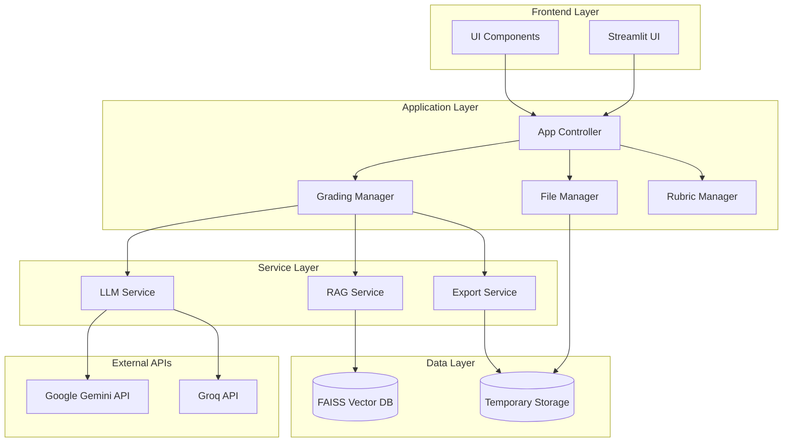
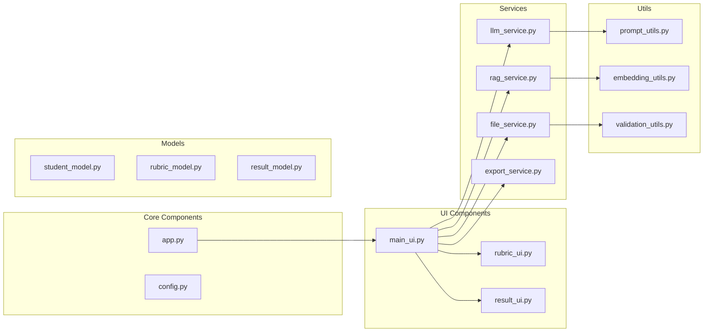
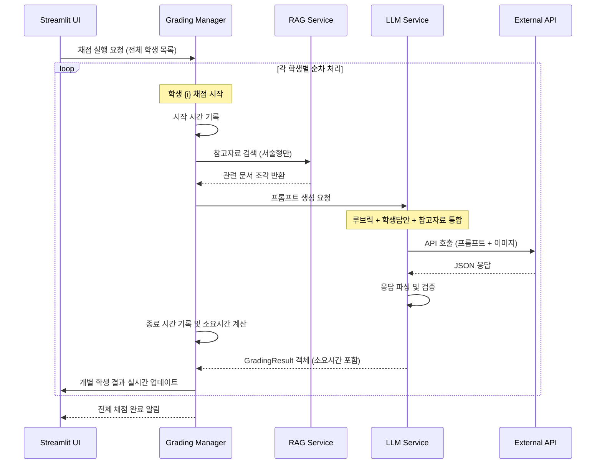

# Design Document

## Overview

지리과 자동 채점 플랫폼은 Streamlit 기반의 웹 애플리케이션으로, 교사가 서술형 및 백지도형 답안을 AI를 활용해 자동으로 채점할 수 있는 시스템입니다. RAG(Retrieval-Augmented Generation) 기술과 다중 LLM 지원을 통해 정확하고 유연한 채점 서비스를 제공합니다.

## Architecture

### System Architecture



### Component Architecture



## Components and Interfaces

### 1. Frontend Components

#### Main UI Controller (`main_ui.py`)
- **Purpose**: 메인 페이지 레이아웃 및 채점 유형 선택 관리
- **Key Methods**:
  - `render_main_page()`: 메인 페이지 렌더링
  - `handle_grading_type_selection()`: 채점 유형 선택 처리
  - `render_file_upload_section()`: 파일 업로드 섹션 렌더링

#### Rubric UI Manager (`rubric_ui.py`)
- **Purpose**: 동적 루브릭 설정 인터페이스 관리
- **Key Methods**:
  - `render_rubric_builder()`: 루브릭 빌더 UI 렌더링
  - `add_evaluation_criteria()`: 평가 요소 추가
  - `remove_evaluation_criteria()`: 평가 요소 제거
  - `validate_rubric()`: 루브릭 유효성 검증

#### Result Display Manager (`result_ui.py`)
- **Purpose**: 채점 결과 시각화 및 다운로드 기능
- **Key Methods**:
  - `render_results()`: 채점 결과 표시
  - `render_student_detail()`: 학생별 상세 결과 표시
  - `generate_download_button()`: Excel 다운로드 버튼 생성

### 2. Service Layer Components

#### RAG Service (`rag_service.py`)
- **Purpose**: 참고 자료 처리 및 벡터 검색 서비스
- **Key Methods**:
  - `process_reference_documents(files)`: 문서 처리 및 임베딩
  - `chunk_documents(content)`: 문서 청킹
  - `create_embeddings(chunks)`: 벡터 임베딩 생성
  - `search_relevant_content(query, top_k=3)`: 관련 내용 검색

#### LLM Service (`llm_service.py`)
- **Purpose**: 다중 LLM API 통합 및 순차적 채점 실행
- **Key Methods**:
  - `select_model(model_type, grading_type)`: 모델 선택
  - `generate_prompt(rubric, student_answer, references=None)`: 프롬프트 생성
  - `grade_student_sequential(student, rubric, references=None)`: 개별 학생 순차 채점
  - `call_gemini_api(prompt, image=None)`: Gemini API 호출
  - `call_groq_api(prompt)`: Groq API 호출
  - `parse_response(response)`: 응답 파싱
  - `measure_processing_time()`: 채점 소요 시간 측정

**Prompt Generation Strategy:**
```python
def generate_prompt(self, rubric: Rubric, student_answer: str, references: List[str] = None, image_path: str = None):
    prompt_parts = []
    
    # 1. 시스템 역할 정의
    prompt_parts.append("당신은 지리 교과목 전문 채점자입니다.")
    
    # 2. 참고 자료 포함 (서술형 전용)
    if references:
        prompt_parts.append("다음은 채점 참고 자료입니다:")
        for i, ref in enumerate(references, 1):
            prompt_parts.append(f"참고자료 {i}: {ref}")
    
    # 3. 평가 루브릭 포함
    prompt_parts.append("다음은 평가 루브릭입니다:")
    for element in rubric.elements:
        prompt_parts.append(f"평가요소: {element.name}")
        for criteria in element.criteria:
            prompt_parts.append(f"  {criteria.score}점: {criteria.description}")
    
    # 4. 학생 답안 포함
    if image_path:
        prompt_parts.append("다음은 학생이 작성한 백지도 답안입니다. 이미지를 분석하여 채점해주세요.")
    else:
        prompt_parts.append(f"다음은 학생 답안입니다: {student_answer}")
    
    # 5. 출력 형식 지정
    prompt_parts.append("""
다음 JSON 형식으로 채점 결과를 제공해주세요:
{
  "scores": {
    "평가요소1": 점수,
    "평가요소2": 점수
  },
  "reasoning": {
    "평가요소1": "점수 부여 근거",
    "평가요소2": "점수 부여 근거"
  },
  "feedback": "학생을 위한 개선 피드백",
  "total_score": 총점
}
""")
    
    return "\n\n".join(prompt_parts)
```

#### File Service (`file_service.py`)
- **Purpose**: 파일 업로드 및 처리 서비스
- **Key Methods**:
  - `validate_excel_format(file, grading_type)`: Excel 파일 형식 검증
  - `process_student_data(excel_file, image_files=None)`: 학생 데이터 처리
  - `match_images_to_students(students, images)`: 이미지-학생 매칭
  - `extract_document_content(file)`: 문서 내용 추출

#### Export Service (`export_service.py`)
- **Purpose**: 결과 내보내기 및 다운로드 서비스
- **Key Methods**:
  - `create_results_excel(results)`: 결과 Excel 파일 생성
  - `format_results_for_export(results)`: 내보내기용 데이터 포맷팅
  - `generate_download_link(file_path)`: 다운로드 링크 생성

### 3. Data Models

#### Student Model (`student_model.py`)
```python
@dataclass
class Student:
    name: str
    class_number: str
    answer: str
    image_path: Optional[str] = None
    
@dataclass
class GradingResult:
    student: Student
    scores: Dict[str, int]
    reasoning: Dict[str, str]
    feedback: str
    total_score: int
    processing_time: float  # 채점 소요 시간 (초)
```

#### Rubric Model (`rubric_model.py`)
```python
@dataclass
class EvaluationCriteria:
    score: int
    description: str

@dataclass
class EvaluationElement:
    name: str
    criteria: List[EvaluationCriteria]
    max_score: int

@dataclass
class Rubric:
    elements: List[EvaluationElement]
    total_max_score: int
```

## Data Models

### Core Data Structures

#### Student Data Flow
1. **Input**: Excel 파일 (학생 이름, 반, 답안/이미지)
2. **Processing**: Student 객체로 변환
3. **Grading**: LLM API 호출 및 결과 파싱
4. **Output**: GradingResult 객체 생성

#### RAG Data Flow
1. **Input**: PDF/DOCX 참고 자료
2. **Processing**: 문서 청킹 및 임베딩
3. **Storage**: FAISS 벡터 데이터베이스
4. **Retrieval**: 학생 답안 기반 관련 내용 검색

#### Sequential Grading Execution Flow


#### Data Integration Validation
- **참고자료 통합**: RAG 검색 결과가 프롬프트에 올바르게 포함되는지 검증
- **루브릭 전달**: 평가 요소와 채점 기준이 구조화되어 전달되는지 확인
- **답안 처리**: 텍스트/이미지 답안이 적절한 형식으로 API에 전달되는지 검증
- **응답 파싱**: JSON 응답이 예상 형식과 일치하는지 검증

### Database Schema

#### FAISS Vector Store
- **Index Type**: IndexFlatIP (Inner Product)
- **Embedding Dimension**: 768 (KURE-v1 모델 기준)
- **Metadata**: 청크 텍스트, 문서 소스, 페이지 번호

## Error Handling

### Error Categories and Handling Strategies

#### 1. File Processing Errors
- **Invalid File Format**: 사용자 친화적 오류 메시지 및 올바른 형식 안내
- **Corrupted Files**: 파일 재업로드 요청
- **Large File Size**: 진행률 표시 및 청크 단위 처리

#### 2. API Communication Errors
- **Network Timeout**: 자동 재시도 (최대 3회)
- **Rate Limiting**: 지수 백오프 재시도
- **Authentication Errors**: API 키 확인 안내

#### 3. Processing Errors
- **Memory Overflow**: 배치 처리 및 메모리 최적화
- **Invalid Response Format**: 응답 파싱 오류 처리 및 재시도
- **Embedding Failures**: 대체 임베딩 방법 제공

### Error Recovery Mechanisms

```python
class ErrorHandler:
    def handle_api_error(self, error, retry_count=0):
        if retry_count < 3:
            time.sleep(2 ** retry_count)  # Exponential backoff
            return self.retry_api_call(retry_count + 1)
        else:
            return self.fallback_response()
    
    def handle_file_error(self, error):
        return {
            "success": False,
            "message": f"파일 처리 중 오류가 발생했습니다: {error}",
            "suggestion": "파일 형식을 확인하고 다시 업로드해주세요."
        }
```

## Testing Strategy

### Unit Testing

#### Component Testing
- **UI Components**: Streamlit 컴포넌트 렌더링 테스트
- **Service Layer**: 각 서비스의 핵심 메서드 단위 테스트
- **Data Models**: 데이터 검증 및 변환 로직 테스트
- **Utilities**: 프롬프트 생성, 임베딩, 검증 유틸리티 테스트

#### Test Coverage Areas
```python
# Example test structure
class TestRAGService:
    def test_document_chunking(self):
        # 문서 청킹 로직 테스트
        
    def test_embedding_generation(self):
        # 임베딩 생성 테스트
        
    def test_similarity_search(self):
        # 유사도 검색 테스트

class TestLLMService:
    def test_prompt_generation(self):
        # 프롬프트 생성 테스트
        
    def test_api_response_parsing(self):
        # API 응답 파싱 테스트
        
    def test_model_selection(self):
        # 모델 선택 로직 테스트
```

### Integration Testing

#### End-to-End Workflows
1. **서술형 채점 플로우**: 참고자료 업로드 → 루브릭 설정 → 학생 답안 업로드 → 채점 실행 → 결과 확인
2. **백지도형 채점 플로우**: 루브릭 설정 → 학생 데이터 및 이미지 업로드 → 채점 실행 → 결과 확인
3. **오류 처리 플로우**: 잘못된 파일 업로드 → 오류 메시지 확인 → 올바른 파일로 재시도

#### API Integration Testing
- **Gemini API**: 텍스트 및 이미지 분석 테스트
- **Groq API**: 텍스트 분석 테스트
- **Rate Limiting**: API 호출 제한 테스트
- **Error Scenarios**: 네트워크 오류, 인증 오류 시나리오 테스트

### Performance Testing

#### Load Testing Scenarios
- **순차 처리 성능**: 다수 학생 답안 순차 채점 시간 측정
- **메모리 사용량**: 대용량 참고 자료 처리 시 메모리 모니터링
- **API 응답 시간**: 개별 API 호출 및 결과 처리 시간 측정
- **UI 반응성**: 순차 처리 중 실시간 결과 업데이트 성능

#### Optimization Targets
- **파일 업로드**: 10MB 이하 파일 5초 이내 처리
- **개별 채점**: 학생 1명당 평균 5-10초 이내 처리 (소요시간 표시)
- **실시간 업데이트**: 개별 결과 1초 이내 UI 반영
- **메모리 사용량**: 최대 1GB 이내 유지 (순차 처리로 최적화)

#### Processing Time Display
- **개별 소요시간**: 각 학생 채점에 걸린 시간 (초 단위)
- **전체 진행률**: 현재 처리 중인 학생 번호 / 전체 학생 수
- **예상 완료시간**: 평균 소요시간 기반 남은 시간 계산
- **결과 내보내기**: Excel 파일에 각 학생별 채점 소요시간 포함