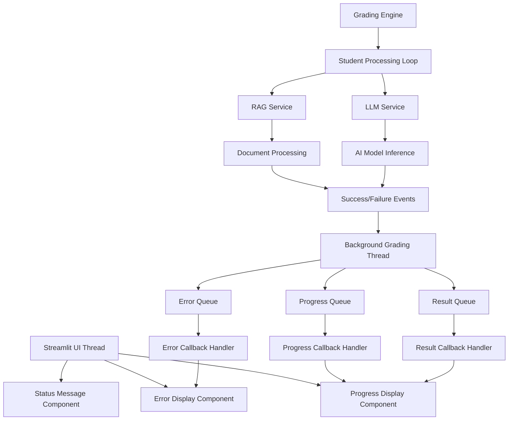

# Design Document

## Overview

채점 시스템의 실시간 UI 피드백 기능을 구현하여 사용자가 채점 진행 상황을 실시간으로 확인하고, RAG 처리 실패 등의 오류를 적절히 처리할 수 있도록 합니다. 현재 시스템은 백그라운드 스레드에서 채점을 진행하지만 UI 업데이트가 제대로 이루어지지 않는 문제를 해결합니다.

## Architecture

### Current System Analysis

현재 시스템 구조:
- **Frontend**: Streamlit 기반 웹 UI
- **Backend**: Python 백그라운드 스레드에서 채점 실행
- **Communication**: Queue 기반 스레드 간 통신 (progress_queue, result_queue)
- **State Management**: Streamlit session_state

### Proposed Architecture



## Components and Interfaces

### 1. Real-time Progress Display Component

**Purpose**: 실시간으로 채점 진행 상황을 표시

**Interface**:
```python
class ProgressDisplayComponent:
    def update_current_student(self, student_name: str, student_index: int)
    def update_progress_metrics(self, completed: int, total: int, failed: int)
    def update_time_estimates(self, avg_time: float, estimated_completion: datetime)
    def display_progress_bar(self, current: int, total: int)
```

### 2. Status Message Manager

**Purpose**: 채점 상태 메시지를 관리하고 표시

**Interface**:
```python
class StatusMessageManager:
    def show_grading_started(self, total_students: int)
    def show_student_grading_start(self, student_name: str)
    def show_student_grading_complete(self, student_name: str, success: bool)
    def show_grading_completed(self, total_completed: int, total_failed: int)
    def show_rag_warning(self, student_name: str, error_message: str)
```

### 3. Enhanced Error Handler

**Purpose**: RAG 실패 및 기타 오류를 사용자 친화적으로 표시

**Interface**:
```python
class EnhancedErrorHandler:
    def handle_rag_failure(self, student_name: str, error_details: str)
    def handle_grading_failure(self, student_name: str, error_details: str)
    def display_error_summary(self, errors: List[ErrorInfo])
    def suggest_recovery_actions(self, error_type: ErrorType)
```

### 4. Queue-based Communication System

**Purpose**: 백그라운드 스레드와 UI 스레드 간 안전한 통신

**Interface**:
```python
class GradingCommunicationManager:
    def __init__(self):
        self.progress_queue = queue.Queue()
        self.status_queue = queue.Queue()
        self.error_queue = queue.Queue()
    
    def send_progress_update(self, progress: GradingProgress)
    def send_status_message(self, message_type: str, data: dict)
    def send_error_notification(self, error_info: ErrorInfo)
    def process_queue_updates(self)
```

## Data Models

### 1. Enhanced Progress Model

```python
@dataclass
class EnhancedGradingProgress:
    total_students: int
    completed_students: int = 0
    failed_students: int = 0
    current_student_index: int = 0
    current_student_name: str = ""
    current_operation: str = ""  # "processing_rag", "grading", "completed"
    start_time: Optional[datetime] = None
    estimated_completion_time: Optional[float] = None
    average_processing_time: float = 0.0
    rag_warnings: List[str] = field(default_factory=list)
    processing_errors: List[str] = field(default_factory=list)
```

### 2. Status Message Model

```python
@dataclass
class StatusMessage:
    message_type: str  # "info", "success", "warning", "error"
    title: str
    content: str
    timestamp: datetime
    student_name: Optional[str] = None
    auto_dismiss: bool = True
    dismiss_after: int = 5  # seconds
```

### 3. Error Notification Model

```python
@dataclass
class ErrorNotification:
    error_type: str  # "rag_failure", "grading_failure", "system_error"
    student_name: str
    error_message: str
    error_details: str
    timestamp: datetime
    severity: str  # "warning", "error", "critical"
    suggested_actions: List[str]
```

## Error Handling

### 1. RAG Processing Error Handling

**Problem**: RAG 처리 실패 시 사용자가 인지하지 못함

**Solution**:
- RAG 실패 시 즉시 UI에 경고 메시지 표시
- 채점은 계속 진행하되 RAG 없이 진행됨을 명시
- 실패한 학생 목록을 별도로 관리

```python
def handle_rag_failure(self, student_name: str, error_message: str):
    warning_msg = StatusMessage(
        message_type="warning",
        title=f"RAG 처리 실패: {student_name}",
        content=f"참고 자료 처리에 실패했습니다. RAG 없이 채점을 계속 진행합니다. 오류: {error_message}",
        timestamp=datetime.now(),
        student_name=student_name,
        auto_dismiss=False
    )
    self.status_queue.put(("warning", warning_msg))
```

### 2. Grading Failure Recovery

**Problem**: 채점 실패 시 복구 옵션이 명확하지 않음

**Solution**:
- 실패 원인별 맞춤형 복구 제안
- 자동 재시도 옵션
- 다른 AI 모델로 전환 옵션

### 3. Thread Communication Error Handling

**Problem**: 스레드 간 통신 실패 시 UI가 멈춤

**Solution**:
- Queue 처리 시 timeout 설정
- 예외 발생 시 fallback 메커니즘
- 주기적인 연결 상태 확인

## Testing Strategy

### 1. Unit Tests

**Progress Display Component Tests**:
```python
def test_progress_display_updates():
    # Test progress bar updates
    # Test metric calculations
    # Test time estimation accuracy

def test_status_message_display():
    # Test message formatting
    # Test auto-dismiss functionality
    # Test message priority handling
```

**Error Handler Tests**:
```python
def test_rag_failure_handling():
    # Test RAG failure detection
    # Test warning message generation
    # Test continued processing without RAG

def test_grading_failure_recovery():
    # Test failure detection
    # Test recovery option suggestions
    # Test retry mechanisms
```

### 2. Integration Tests

**Queue Communication Tests**:
```python
def test_thread_communication():
    # Test progress updates from background thread
    # Test error propagation
    # Test queue overflow handling

def test_ui_responsiveness():
    # Test UI updates during grading
    # Test user interaction during grading
    # Test concurrent access handling
```

### 3. End-to-End Tests

**Complete Grading Flow Tests**:
```python
def test_complete_grading_with_errors():
    # Test grading with RAG failures
    # Test grading with mixed success/failure
    # Test user interaction with error recovery

def test_real_time_feedback():
    # Test progress updates accuracy
    # Test status message timing
    # Test completion notification
```

### 4. Performance Tests

**UI Responsiveness Tests**:
```python
def test_ui_performance_under_load():
    # Test UI responsiveness with many students
    # Test queue processing performance
    # Test memory usage during long grading sessions
```

## Implementation Approach

### Phase 1: Enhanced Progress Display
1. 현재 학생 정보 실시간 표시
2. 진행률 및 시간 추정 개선
3. 상태별 시각적 피드백 강화

### Phase 2: Error Handling Enhancement
1. RAG 실패 감지 및 알림
2. 오류별 맞춤형 메시지
3. 복구 옵션 제공

### Phase 3: Communication Reliability
1. Queue 기반 통신 안정화
2. 스레드 안전성 강화
3. 예외 상황 처리 개선

### Phase 4: User Experience Optimization
1. 실시간 알림 시스템
2. 진행 상황 요약 대시보드
3. 채점 완료 후 결과 접근성 개선

## Security Considerations

1. **Thread Safety**: 멀티스레드 환경에서 안전한 데이터 접근
2. **Error Information**: 민감한 오류 정보 노출 방지
3. **Resource Management**: 메모리 누수 및 리소스 정리

## Performance Considerations

1. **UI Update Frequency**: 너무 빈번한 업데이트로 인한 성능 저하 방지
2. **Queue Size Management**: 큐 크기 제한으로 메모리 사용량 관리
3. **Batch Processing**: 대량 학생 처리 시 배치 단위 진행 상황 업데이트