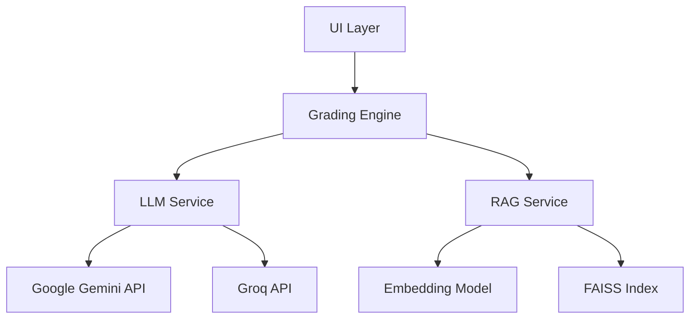
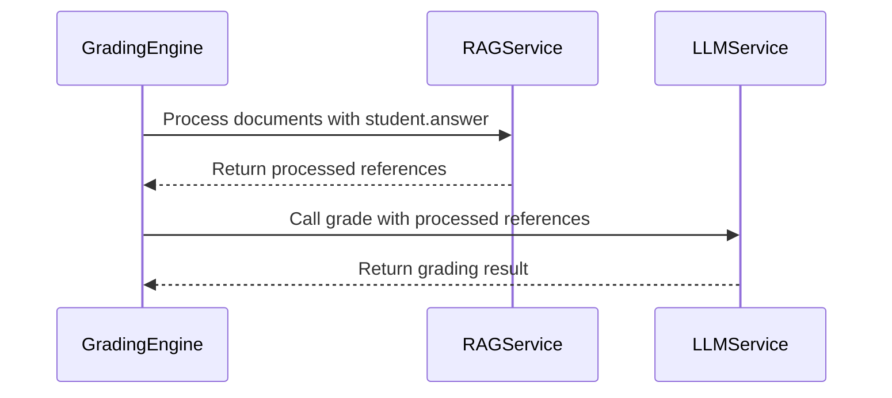

# Grading Error Fix Design Document

## Overview

This document outlines the design for fixing two critical errors in the geography auto-grading system:
1. `'Student' object has no attribute 'descriptive_answer'` - An attribute access error in the grading engine
2. `name 'references' is not defined` - A variable scoping error in the LLM service

These errors prevent the grading system from functioning correctly when processing student submissions.

## Architecture

The system follows a layered architecture with the following key components:



The errors occur in the data flow between the Grading Engine and LLM Service components.

## Issues Analysis

### Issue 1: Student Attribute Error
**Location**: `services/grading_engine.py`, line 322
**Problem**: Code attempts to access `student.descriptive_answer` but the `Student` model only has an `answer` attribute, not `descriptive_answer`.

### Issue 2: Undefined References Variable
**Location**: `services/llm_service.py`, in the `generate_prompt` method
**Problem**: The `generate_prompt` method has parameter `references_hash` but tries to use undefined variable `references`. Additionally, it tries to use undefined variable `rubric`.

## Fixes Implementation

### Fix 1: Correct Student Attribute Access

The `Student` model has an `answer` attribute that should be used instead of `descriptive_answer`. The fix involves:

1. In `services/grading_engine.py`, replace `student.descriptive_answer` with `student.answer` on line 322

### Fix 2: Fix LLM Service Method Signature

The `generate_prompt` method in `services/llm_service.py` has several issues that need to be fixed:

1. Change the parameter from `references_hash` to `references`
2. Add `rubric` as a parameter
3. Update the method body to use the correct parameter names
4. Update the documentation to match the actual parameters

## Data Flow Correction



## Implementation Plan

### Step 1: Fix Student Attribute Access
- Modify `services/grading_engine.py` line 322
- Replace `student.descriptive_answer` with `student.answer`

### Step 2: Fix LLM Service Method Signature
- Modify `services/llm_service.py` in the `generate_prompt` method
- Change parameter `references_hash` to `references: Optional[List[str]]`
- Add parameter `rubric: Rubric`
- Update method body to use correct parameter names
- Update documentation to match actual parameters

### Step 3: Update Method Call
- Modify `services/llm_service.py` in the `generate_prompt_with_caching` method
- Update the call to `generate_prompt` to pass the correct parameters

## Detailed Code Changes

### Change 1: Fix Student Attribute Access

In `services/grading_engine.py` line 322, change:
```python
rag_result = rag_service.process_documents_for_student(
    uploaded_files, 
    student.descriptive_answer
)
```

to:
```python
rag_result = rag_service.process_documents_for_student(
    uploaded_files, 
    student.answer
)
```

### Change 2: Fix LLM Service Method Signature

In `services/llm_service.py`, update the `generate_prompt` method:

Change the method signature from:
```python
@lru_cache(maxsize=50)
def generate_prompt(
    self, 
    rubric_hash: str,
    student_answer: str = "", 
    references_hash: Optional[str] = None,
    grading_type: str = GradingType.DESCRIPTIVE
) -> str:
```

to:
```python
@lru_cache(maxsize=50)
def generate_prompt(
    self, 
    rubric: Rubric,
    student_answer: str = "", 
    references: Optional[List[str]] = None,
    grading_type: str = GradingType.DESCRIPTIVE
) -> str:
```

Update the method documentation to correctly describe the parameters.

### Change 3: Fix Method Body

In the method body, update all references to use the correct parameter names:
1. Replace all uses of `references_hash` with `references`
2. Replace all uses of `rubric_hash` with `rubric`

### Change 4: Update Method Call

In the `generate_prompt_with_caching` method, change the call to `generate_prompt` from:
```python
return self.generate_prompt(
    rubric_hash=rubric_hash,
    student_answer=student_answer,
    references_hash=references_hash,
    grading_type=grading_type
)
```

to:
```python
return self.generate_prompt(
    rubric=rubric,
    student_answer=student_answer,
    references=references,
    grading_type=grading_type
)
```

## Testing Strategy

### Unit Tests
1. Test student attribute access with different student objects
2. Test RAG processing with various reference document types
3. Test LLM service calls with and without reference materials
4. Test that the fixed `generate_prompt` method works correctly

### Integration Tests
1. End-to-end grading process with text answers
2. End-to-end grading process with reference documents
3. Error handling for missing or invalid student data

## Error Handling Improvements

The fixes will include enhanced error handling:

1. **Student Data Validation**:
   - Check for valid text answers before processing
   - Provide clear error messages for missing data

2. **Reference Processing**:
   - Handle cases where no references are provided
   - Gracefully handle RAG processing failures

3. **LLM Service Calls**:
   - Ensure all required variables are properly scoped
   - Add fallback mechanisms for API failures

4. **Method Signature Consistency**:
   - Ensure method signatures match their implementations
   - Provide clear parameter documentation