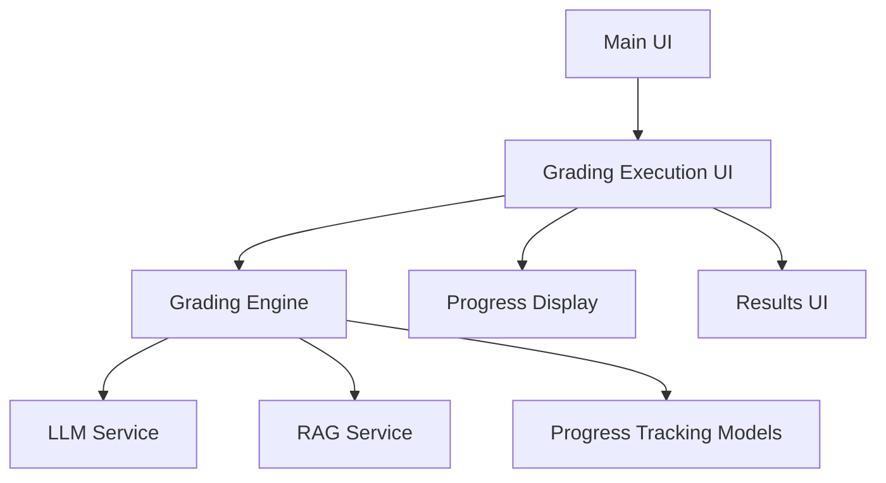

# Grading Progress Display and Result Output Enhancement Design

## 1. Overview

This design document outlines the necessary changes to fix the issues with grading progress display and result output in the geography auto-grading platform. The main problems identified are:

1. The grading progress is not being displayed properly during the grading process
2. The grading completion is not being detected correctly, preventing the results from being shown
3. The current student's name is not being displayed during grading
4. Completed results are not being properly shown even when grading is finished

These issues are causing a poor user experience where users cannot see real-time progress updates or access their grading results after completion.

## 2. Current Architecture

### 2.1 Component Structure

The grading system consists of the following key components:



### 2.2 Data Flow

1. Main UI collects user inputs (files, model selection, etc.)
2. Grading Execution UI initiates the grading process
3. Grading Engine orchestrates the grading with progress tracking
4. Progress updates are sent through callbacks to the UI
5. Results are stored in session state and displayed in Results UI

## 3. Identified Issues

### 3.1 Progress Display Issues

1. **Missing Current Student Name**: The current student's name is not being properly displayed during grading
2. **Progress Not Updating**: The progress bar and metrics are not updating in real-time
3. **Completion Detection Failure**: The system doesn't properly detect when grading is completed

### 3.2 Result Output Issues

1. **Navigation Failure**: After grading completion, the system doesn't automatically navigate to the results page
2. **Result Display**: Completed results are not being shown even when grading is finished

## 4. Proposed Solutions

### 4.1 Fix Progress Display

#### 4.1.1 Enhance Progress Callback Handling

The issue lies in the `update_progress_from_queue` method in `grading_execution_ui.py`. We need to ensure that:

1. Progress updates are properly processed from the queue
2. The UI is refreshed to show updated information
3. Current student information is correctly extracted and displayed

#### 4.1.2 Improve Current Student Display

In the `render_progress_display` method, we need to ensure the current student's name is properly extracted and displayed:

```python
# Current implementation has issues with student indexing
current_student_name = ""
if progress.current_student_index < len(st.session_state.grading_session.students):
    current_student = st.session_state.grading_session.students[progress.current_student_index]
    current_student_name = f"{current_student.name} ({current_student.class_number})"
```

### 4.2 Fix Completion Detection

#### 4.2.1 Improve Completion Logic

The completion detection logic in `render_grading_controls` and `render_progress_display` needs to be enhanced:

```python
# Current logic is incomplete
if session and not session.is_active and st.session_state.grading_progress:
    if st.session_state.grading_progress.completed_students + st.session_state.grading_progress.failed_students == st.session_state.grading_progress.total_students:
        # Grading is actually completed
```

#### 4.2.2 Add Automatic Navigation

After detecting completion, we need to automatically navigate to the results page or at least provide a clear indication that grading is complete.

### 4.3 Enhance Result Output

#### 4.3.1 Fix Result Storage

Ensure that results are properly stored in session state when grading completes:

```python
# In the completion handler
st.session_state.student_results = results
st.session_state.current_page = "results"
```

#### 4.3.2 Improve Result Display Logic

Enhance the result display logic to handle cases where grading has completed but results haven't been displayed.

### 4.4 Fix Queue Processing Issues

The `update_progress_from_queue` method has issues with properly handling all queue messages, particularly the completion message. We need to ensure that:

1. All queue messages are properly processed
2. The UI is refreshed after processing completion messages
3. Session state is properly updated to reflect completion status

## 5. Implementation Plan

### 5.1 Phase 1: Fix Progress Display

1. **Modify `grading_execution_ui.py`**:
   - Enhance `update_progress_from_queue` method to properly handle all queue messages
   - Fix `render_progress_display` to correctly display current student name
   - Ensure progress bar updates with each progress update

2. **Update Progress Tracking**:
   - Verify that progress callbacks are properly triggered from the grading engine
   - Ensure student indexing is correct when accessing current student information

### 5.2 Phase 2: Fix Completion Detection

1. **Enhance Completion Logic**:
   - Improve the logic in `render_grading_controls` and `render_progress_display` to correctly detect completion
   - Add proper state management for completed grading sessions

2. **Add Completion Handler**:
   - Implement a completion handler that triggers when grading is finished
   - Ensure session state is properly updated to reflect completion

### 5.3 Phase 3: Enhance Result Output

1. **Fix Result Storage**:
   - Ensure results are properly stored in session state upon completion
   - Add error handling for result storage

2. **Improve Navigation**:
   - Add automatic navigation to results page upon completion
   - Provide clear user feedback when grading is complete

### 5.4 Phase 4: Fix Queue Processing

1. **Enhance Queue Processing**:
   - Fix the `update_progress_from_queue` method to properly process all message types
   - Ensure the completion message triggers proper UI updates
   - Add error handling for queue processing

2. **Improve Session State Management**:
   - Ensure session state is properly updated when grading completes
   - Verify that results are correctly stored in session state

## 6. Code Changes Required

### 6.1 Changes to `ui/grading_execution_ui.py`

#### 6.1.1 Update `update_progress_from_queue` Method

The key issue is that the completion message is not properly triggering a UI refresh. We need to ensure `st.rerun()` is called after processing the completion message:

```python
def update_progress_from_queue(self):
    """Update UI from background thread queues with error handling."""
    # Process progress updates
    try:
        while True:
            update_type, data = self.progress_queue.get_nowait()
            
            if update_type == 'progress':
                st.session_state.grading_progress = data
                # Force UI update for progress changes
                # st.rerun()  # Only rerun for critical updates to avoid excessive refreshes
            
            elif update_type == 'error':
                if isinstance(data, ErrorInfo):
                    display_error(data)
                else:
                    st.error(f"채점 오류: {data}")
            
            elif update_type == 'thread_error':
                display_error(data)
                if st.session_state.grading_session:
                    st.session_state.grading_session.is_active = False
                st.rerun()
            
            elif update_type == 'completed':
                # Handle completion - this is the key fix
                if st.session_state.grading_session:
                    st.session_state.grading_session.is_active = False
                    st.session_state.grading_session.is_paused = False
                st.success(f"🎉 채점이 완료되었습니다! 총 {data}명의 학생이 채점되었습니다.")
                # Auto-navigate to results page after a short delay
                st.session_state.current_page = "results"
                st.rerun()  # Critical: Force UI refresh to show results page
    except queue.Empty:
        pass  # No more items in queue
    except Exception as e:
        st.error(f"Progress update error: {e}")
```

#### 6.1.2 Fix `render_progress_display` Method

We need to ensure the current student name is properly displayed and that the completion detection works correctly:

```python
def render_progress_display(self):
    """Render real-time progress display with error handling."""
    progress = st.session_state.grading_progress
    session = st.session_state.grading_session
    
    if not progress:
        return
    
    # Check if grading is actually completed - improved logic
    if (session and not session.is_active and 
        progress.total_students > 0 and
        (progress.completed_students + progress.failed_students) >= progress.total_students):
        st.success("✅ 채점이 완료되었습니다! 결과를 확인해주세요.")
        if st.button("📊 결과 보기", type="primary"):
            st.session_state.current_page = "results"
            st.rerun()
        return
    
    st.markdown("### 📈 진행 상황")
    
    # Progress metrics
    col1, col2, col3, col4 = st.columns(4)
    
    with col1:
        st.metric(
            "완료된 학생",
            f"{progress.completed_students}/{progress.total_students}",
            delta=f"{progress.progress_percentage:.1f}%"
        )
    
    with col2:
        if progress.failed_students > 0:
            st.metric("실패한 학생", progress.failed_students, delta="오류")
        else:
            st.metric("실패한 학생", progress.failed_students)
    
    with col3:
        if progress.average_processing_time > 0:
            st.metric(
                "평균 소요시간",
                f"{progress.average_processing_time:.1f}초"
            )
        else:
            st.metric("평균 소요시간", "계산 중...")
    
    with col4:
        if progress.estimated_completion_time:
            remaining_time = progress.estimated_completion_time - time.time()
            if remaining_time > 0:
                minutes, seconds = divmod(int(remaining_time), 60)
                st.metric("예상 완료시간", f"{minutes}분 {seconds}초")
            else:
                st.metric("예상 완료시간", "곧 완료")
        else:
            st.metric("예상 완료시간", "계산 중...")
    
    # Enhanced progress display with error handling
    current_student_name = ""
    # Improved logic to safely access current student
    if (session and session.students and 
        hasattr(progress, 'current_student_index') and
        0 <= progress.current_student_index < len(session.students)):
        current_student = session.students[progress.current_student_index]
        current_student_name = f"{current_student.name} ({current_student.class_number})"
    elif session and session.students:
        # Fallback to first student if index is invalid
        current_student = session.students[0]
        current_student_name = f"{current_student.name} ({current_student.class_number})"
    
    # Use error-aware progress display
    display_progress_with_error_handling(
        current=progress.completed_students,
        total=progress.total_students,
        current_item=current_student_name,
        recent_errors=st.session_state.grading_errors[-5:]  # Show last 5 errors
    )
```

#### 6.1.3 Fix `render_grading_controls` Method

We also need to improve the completion detection in the grading controls:

```python
def render_grading_controls(self):
    """Render grading control buttons."""
    session = st.session_state.grading_session
    
    st.markdown("### 🎮 채점 제어")
    
    # Improved completion detection
    if (session and not session.is_active and 
        st.session_state.grading_progress and
        st.session_state.grading_progress.total_students > 0 and
        (st.session_state.grading_progress.completed_students + 
         st.session_state.grading_progress.failed_students) >= 
         st.session_state.grading_progress.total_students):
        # Grading is actually completed
        st.success("✅ 채점이 완료되었습니다!")
        if st.button("📊 결과 보기", type="primary", use_container_width=True):
            st.session_state.current_page = "results"
            st.rerun()
        return
    
    col1, col2, col3, col4 = st.columns(4)
    
    with col1:
        # Start grading button
        if not session or not session.is_active:
            if st.button(
                "🚀 채점 시작",
                key="start_grading",
                type="primary",
                use_container_width=True,
                help="모든 학생에 대한 순차 채점을 시작합니다"
            ):
                self.start_grading()
        else:
            st.button(
                "⏳ 채점 진행 중...",
                key="grading_in_progress",
                disabled=True,
                use_container_width=True
            )
    
    with col2:
        # Pause/Resume button
        if session and session.is_active:
            if not session.is_paused:
                if st.button(
                    "⏸️ 일시정지",
                    key="pause_grading",
                    use_container_width=True,
                    help="현재 학생 채점 완료 후 일시정지합니다"
                ):
                    self.pause_grading()
            else:
                if st.button(
                    "▶️ 재시작",
                    key="resume_grading",
                    use_container_width=True,
                    help="일시정지된 채점을 재시작합니다"
                ):
                    self.resume_grading()
    
    with col3:
        # Stop grading button
        if session and session.is_active:
            if st.button(
                "⏹️ 채점 중단",
                key="stop_grading",
                use_container_width=True,
                help="채점을 완전히 중단합니다"
            ):
                self.stop_grading()
    
    with col4:
        # Retry failed button (only show if there are failed students)
        if (session and not session.is_active and 
            st.session_state.grading_progress and 
            st.session_state.grading_progress.failed_students > 0):
            if st.button(
                "🔄 실패 재시도",
                key="retry_failed",
                use_container_width=True,
                help="실패한 학생들만 다시 채점합니다"
            ):
                self.retry_failed_students()
    
    # Show current status
    if session and session.is_active:
        if session.is_paused:
            st.warning("⏸️ 채점이 일시정지되었습니다. 재시작 버튼을 눌러 계속 진행하세요.")
        else:
            st.info("🔄 채점이 진행 중입니다. 실시간으로 결과가 업데이트됩니다.")
```

### 6.2 Changes to `services/grading_engine.py`

#### 6.2.1 Update `grade_students_sequential` Method

We need to ensure the completion notification is properly sent and that progress updates are consistently notified:

```python
def grade_students_sequential(
    self,
    students: List[Student],
    rubric: Rubric,
    model_type: str,
    grading_type: str,
    references: Optional[List[str]] = None,
    groq_model_name: str = "qwen/qwen3-32b",
    max_retries: Optional[int] = None,
    uploaded_files: Optional[List] = None
) -> List[GradingResult]:
    """
    Grade multiple students sequentially with comprehensive progress tracking.
    """
    # Initialize grading session
    self.current_batch_id = f"batch_{int(time.time())}"
    self.is_cancelled = False
    max_retries = max_retries or config.MAX_RETRIES
    
    # Initialize progress tracking
    self._initialize_progress_tracking(students)
    
    logger.info(f"Starting sequential grading for {len(students)} students (batch: {self.current_batch_id})")
    
    results = []
    processing_times = []
    
    try:
        for i, student in enumerate(students):
            if self.is_cancelled:
                logger.info("Grading cancelled by user")
                break
            
            # Update current student index
            self.progress.current_student_index = i
            self._notify_progress_update()
            
            # Get student status
            student_status = self.student_statuses[i]
            
            # Grade individual student with retries
            result = self._grade_student_with_retries(
                student_status=student_status,
                rubric=rubric,
                model_type=model_type,
                grading_type=grading_type,
                references=references,
                groq_model_name=groq_model_name,
                max_retries=max_retries,
                uploaded_files=uploaded_files
            )
            
            # Always append result (even error results)
            if result:
                results.append(result)
                processing_times.append(result.grading_time_seconds)
                
                # Check if this was a successful grading or an error result
                if student_status.status == GradingStatus.COMPLETED:
                    self.progress.completed_students += 1
                else:
                    self.progress.failed_students += 1
            else:
                self.progress.failed_students += 1
            
            # Update time estimates
            self.progress.update_estimates(processing_times)
            
            # Notify callbacks
            self._notify_progress_update()
            if self.student_completed_callback:
                self.student_completed_callback(student_status)
            
            logger.info(f"Completed {i + 1}/{len(students)} students")
    
    except Exception as e:
        logger.error(f"Critical error in grading process: {e}")
        if self.error_callback:
            self.error_callback("Critical grading error", e)
        raise
    
    finally:
        # Finalize progress
        if self.progress:
            if not self.is_cancelled:
                logger.info(f"Sequential grading completed. {len(results)}/{len(students)} students graded successfully")
                # Send completion notification with count of successfully graded students
                successfully_graded = len([r for r in results if r is not None])
                self.progress_queue.put(('completed', successfully_graded))  # Ensure completion message is sent
                # Also send final progress update
                if self.progress_callback:
                    self.progress_callback(self.progress)
            else:
                logger.info(f"Sequential grading cancelled. {len(results)}/{len(students)} students completed before cancellation")
    
    return results
```

#### 6.2.2 Fix `run_grading_thread` Method

We also need to ensure the completion message is properly sent from the grading thread:

```python
def run_grading_thread(self, session: GradingSession):
    """Run grading in background thread with comprehensive error handling."""
    try:
        # Get the selected Groq model from session state
        groq_model_name = getattr(st.session_state, 'selected_groq_model', 'qwen/qwen3-32b')
        
        results = self.grading_engine.grade_students_sequential(
            students=session.students,
            rubric=session.rubric,
            model_type=session.model_type,
            grading_type=session.grading_type,
            references=session.references,
            groq_model_name=groq_model_name,
            uploaded_files=session.uploaded_files  # Pass uploaded files for on-demand RAG processing
        )
        
        # Mark session as completed
        session.is_active = False
        session.is_paused = False
        
        # Send completion notification with count of successfully graded students
        successfully_graded = len([r for r in results if r is not None])
        self.progress_queue.put(('completed', successfully_graded))
        
    except Exception as e:
        # Handle thread errors with proper error categorization
        error_info = handle_error(
            e,
            ErrorType.SYSTEM,
            context="run_grading_thread: grading execution failed",
            user_context="채점 실행"
        )
        
        # Mark session as failed
        session.is_active = False
        session.is_paused = False
        
        # Send error to UI thread
        self.progress_queue.put(('thread_error', error_info))
```

## 7. Testing Strategy

### 7.1 Unit Tests

1. **Progress Tracking Tests**:
   - Verify that progress updates are correctly sent from the grading engine
   - Test that current student information is properly tracked
   - Confirm completion detection works correctly

2. **UI Update Tests**:
   - Test that the UI properly updates with progress information
   - Verify that current student name is displayed correctly
   - Confirm that completion navigation works

3. **Queue Processing Tests**:
   - Test that all queue messages are properly processed
   - Verify that completion messages trigger UI refreshes
   - Confirm that error messages are properly displayed

### 7.2 Integration Tests

1. **End-to-End Grading Flow**:
   - Test the complete grading process from start to finish
   - Verify that progress is displayed throughout the process
   - Confirm that results are shown after completion

2. **Error Handling Tests**:
   - Test scenarios with student grading failures
   - Verify that errors are properly displayed
   - Confirm that the system can recover from errors

3. **Edge Case Tests**:
   - Test with empty student lists
   - Verify behavior with invalid session states
   - Confirm proper handling of network errors during grading

## 8. Expected Outcomes

After implementing these changes, the system should:

1. **Display Real-time Progress**: Show accurate progress information during grading
2. **Show Current Student**: Display the name of the student currently being graded
3. **Detect Completion**: Properly identify when grading is complete
4. **Navigate to Results**: Automatically or manually navigate to the results page after completion
5. **Display Results**: Show the grading results correctly after completion
6. **Handle Errors Gracefully**: Properly display and recover from errors during grading
7. **Maintain Session State**: Preserve grading results and progress information throughout the process

## 9. Risk Mitigation

1. **Backward Compatibility**: Ensure that changes don't break existing functionality
2. **Error Handling**: Maintain robust error handling throughout the grading process
3. **Performance**: Ensure that progress updates don't significantly impact grading performance
4. **User Experience**: Provide clear feedback to users throughout the grading process
5. **Session State Management**: Ensure session state is properly managed to prevent data loss
6. **UI Refresh Optimization**: Balance UI refresh frequency to avoid excessive rerenders while ensuring updates are visible