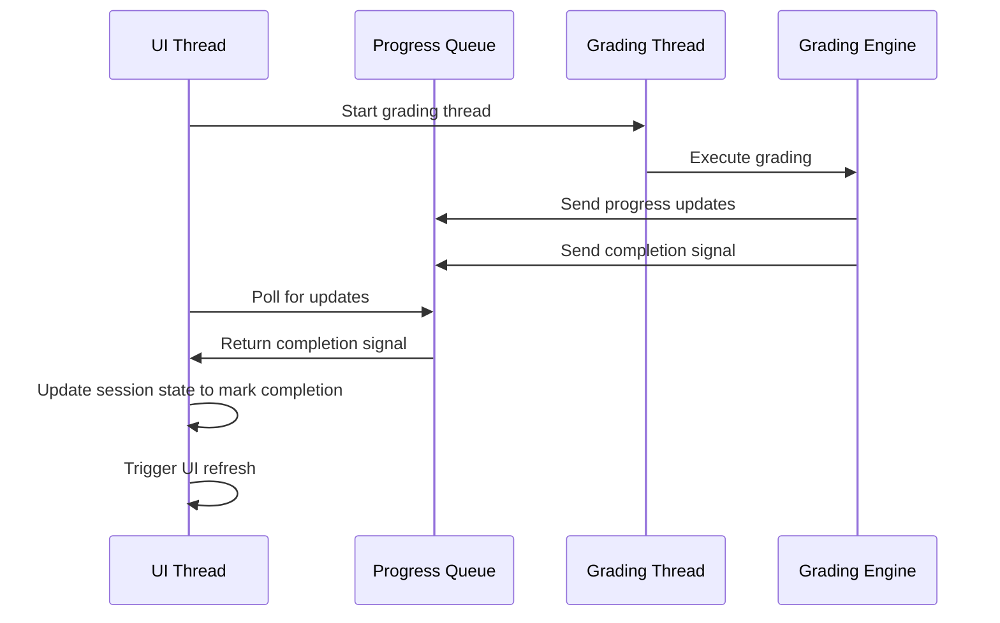
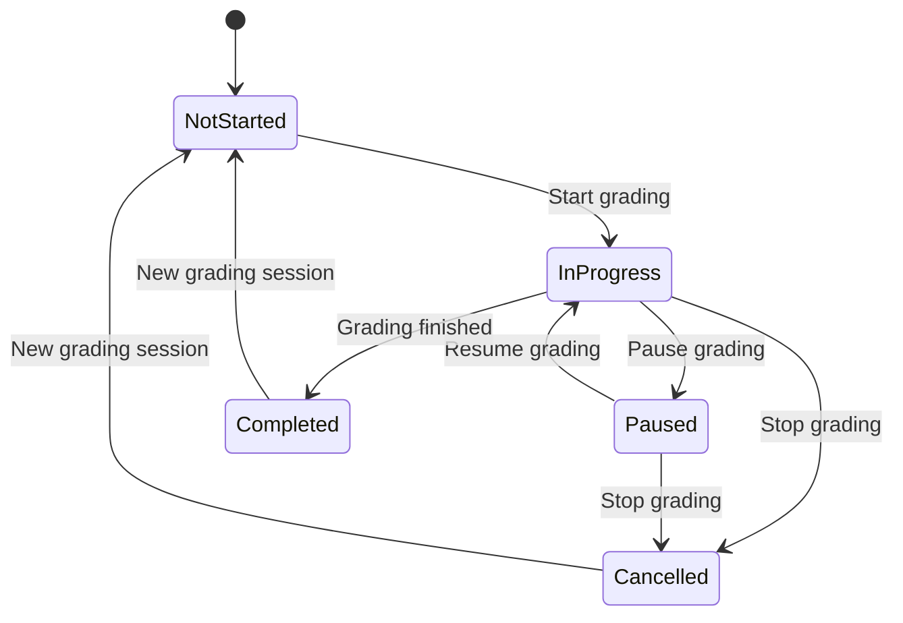

# Grading Status Update Fix Design

## Overview

This design addresses the issue where the grading completion status is not properly reflected in the UI despite successful backend execution. The problem occurs because the UI state is not updated when the grading thread completes, causing the UI to remain in "grading in progress" state even after all students have been successfully graded.

Based on the log analysis, the backend grading process completes successfully:
- All 5 students are graded
- Sequential grading completed message is logged
- But the UI still shows "채점 진행중" (grading in progress)

## Architecture

The current system follows this flow:
1. User initiates grading through the UI
2. GradingExecutionUI starts a background thread for grading
3. SequentialGradingEngine processes students sequentially
4. Progress updates are sent through queues to the UI
5. However, the final completion state is not properly handled

The issue is in the communication between the background grading thread and the main UI thread. While progress updates are sent through queues, the completion signal is not properly processed to update the UI state.

## Solution Design

### 1. Enhanced Completion Signal Handling

Modify the `update_progress_from_queue` method in `GradingExecutionUI` to properly handle the completion signal:



### 2. Session State Management

Enhance session state management to properly track grading completion:



### 3. UI Refresh Mechanism

Implement proper UI refresh when grading completes to show results page automatically.

## Implementation Details

### 1. Update run_grading_thread Method

Modify the `run_grading_thread` method in `GradingExecutionUI` to ensure proper completion signaling:

```python
def run_grading_thread(self, session: GradingSession):
    """Run grading in background thread with comprehensive error handling."""
    try:
        # Get the selected Groq model from session state
        groq_model_name = getattr(st.session_state, 'selected_groq_model', 'qwen/qwen3-32b')
        
        results = self.grading_engine.grade_students_sequential(
            students=session.students,
            rubric=session.rubric,
            model_type=session.model_type,
            grading_type=session.grading_type,
            references=session.references,
            groq_model_name=groq_model_name,
            uploaded_files=session.uploaded_files  # Pass uploaded files for on-demand RAG processing
        )
        
        # Mark session as completed
        session.is_active = False
        session.is_paused = False
        
        # Send completion notification with count of successfully graded students
        successfully_graded = len([r for r in results if r is not None])
        self.progress_queue.put(('completed', successfully_graded))
        
    except Exception as e:
        # Handle thread errors with proper error categorization
        error_info = handle_error(
            e,
            ErrorType.SYSTEM,
            context="run_grading_thread: grading execution failed",
            user_context="채점 실행"
        )
        
        # Mark session as failed
        session.is_active = False
        session.is_paused = False
        
        # Send error to UI thread
        self.progress_queue.put(('thread_error', error_info))
```

### 2. Update update_progress_from_queue Method

Modify the `update_progress_from_queue` method to properly handle completion signals:

```python
def update_progress_from_queue(self):
    """Update UI from background thread queues with error handling."""
    # Process progress updates
    try:
        while True:
            update_type, data = self.progress_queue.get_nowait()
            
            if update_type == 'progress':
                st.session_state.grading_progress = data
            
            elif update_type == 'error':
                if isinstance(data, ErrorInfo):
                    display_error(data)
                else:
                    st.error(f"채점 오류: {data}")
            
            elif update_type == 'thread_error':
                display_error(data)
                if st.session_state.grading_session:
                    st.session_state.grading_session.is_active = False
                st.rerun()
            
            elif update_type == 'completed':
                # Handle completion - this is the key fix
                if st.session_state.grading_session:
                    st.session_state.grading_session.is_active = False
                    st.session_state.grading_session.is_paused = False
                st.success(f"🎉 채점이 완료되었습니다! 총 {data}명의 학생이 채점되었습니다.")
                # Auto-navigate to results page after a short delay
                # st.session_state.current_page = "results"
                # st.rerun()
                
    except queue.Empty:
        pass
    
    # Process result updates
    try:
        while True:
            update_type, data = self.result_queue.get_nowait()
            if update_type == 'result':
                # Result already added in callback
                pass
    except queue.Empty:
        pass
```

### 3. Update UI Display Logic

Modify the grading controls display to properly reflect completion state:

```python
def render_grading_controls(self):
    """Render grading control buttons."""
    session = st.session_state.grading_session
    
    st.markdown("### 🎮 채점 제어")
    
    # Check if grading is actually completed
    if session and not session.is_active and st.session_state.grading_progress:
        if st.session_state.grading_progress.completed_students + st.session_state.grading_progress.failed_students == st.session_state.grading_progress.total_students:
            # Grading is actually completed
            st.success("✅ 채점이 완료되었습니다!")
            if st.button("📊 결과 보기", type="primary", use_container_width=True):
                st.session_state.current_page = "results"
                st.rerun()
            return
    
    col1, col2, col3, col4 = st.columns(4)
    
    with col1:
        # Start grading button
        if not session or not session.is_active:
            if st.button(
                "🚀 채점 시작",
                key="start_grading",
                type="primary",
                use_container_width=True,
                help="모든 학생에 대한 순차 채점을 시작합니다"
            ):
                self.start_grading()
        else:
            st.button(
                "⏳ 채점 진행 중...",
                key="grading_in_progress",
                disabled=True,
                use_container_width=True
            )
    
    # ... rest of existing control logic
```

### 4. Add Completion Check in Progress Display

Add a check in the progress display to show completion status:

```python
def render_progress_display(self):
    """Render real-time progress display with error handling."""
    progress = st.session_state.grading_progress
    session = st.session_state.grading_session
    
    if not progress:
        return
    
    # Check if grading is actually completed
    if (session and not session.is_active and 
        progress.total_students > 0 and
        progress.completed_students + progress.failed_students == progress.total_students):
        st.success("✅ 채점이 완료되었습니다! 결과를 확인해주세요.")
        if st.button("📊 결과 보기", type="primary"):
            st.session_state.current_page = "results"
            st.rerun()
        return
    
    # ... rest of existing progress display logic
```

## Data Models & State Management

### Session State Variables

The fix will rely on proper management of these session state variables:

| Variable | Type | Purpose |
|----------|------|---------|
| `grading_session.is_active` | Boolean | Tracks if grading is currently active |
| `grading_session.is_paused` | Boolean | Tracks if grading is paused |
| `grading_progress.completed_students` | Integer | Number of successfully graded students |
| `grading_progress.failed_students` | Integer | Number of failed students |
| `grading_progress.total_students` | Integer | Total number of students to grade |

## Files to be Modified

1. **`ui/grading_execution_ui.py`** - Primary file requiring changes:
   - Update `run_grading_thread` method to ensure proper completion signaling
   - Update `update_progress_from_queue` method to handle completion signals
   - Update `render_grading_controls` method to properly reflect completion state
   - Update `render_progress_display` method to show completion status

2. **`services/grading_engine.py`** - May require minor adjustments:
   - Verify `grade_students_sequential` method properly returns results
   - Ensure completion signals are properly sent

## Testing

### Unit Tests

1. Test completion signal handling:
   - Verify that completion signals properly update session state
   - Ensure UI refreshes when grading completes
   - Check that results page is accessible after completion

2. Test edge cases:
   - Partial completion with some failures
   - Immediate completion (0 students)
   - Cancelled grading state
   - Session state corruption recovery

3. Test UI state transitions:
   - Not started → In progress → Completed
   - In progress → Paused → In progress → Completed
   - In progress → Cancelled

### Integration Tests

1. End-to-end grading flow:
   - Start grading process
   - Monitor progress updates
   - Verify completion state transition
   - Confirm results page navigation

2. Error recovery tests:
   - Simulate API failures during grading
   - Verify error display and recovery options
   - Test retry mechanisms

3. Performance tests:
   - Large batch grading (50+ students)
   - Verify UI responsiveness during grading
   - Check memory usage patterns

## Business Logic

The core business logic change is in recognizing when grading is actually complete. The system needs to:

1. Properly detect when all students have been processed (success or failure)
2. Update the session state to mark grading as inactive
3. Provide clear visual feedback to the user
4. Enable easy navigation to results

This requires checking if `completed_students + failed_students == total_students` in addition to the `is_active` flag.

### Completion Detection Logic

The key insight is that completion should be detected by:

1. Checking if the grading session is marked as inactive (`is_active == False`)
2. Verifying that all students have been processed (`completed_students + failed_students == total_students`)
3. Ensuring the progress object exists and has valid data

This approach is more reliable than relying solely on the `is_active` flag, which may not be properly updated in some edge cases.

## Error Handling

The solution includes robust error handling:

1. Thread error handling with proper categorization
2. Graceful degradation when session state is not properly initialized
3. Clear error messages for different failure scenarios
4. Recovery options for failed grading attempts