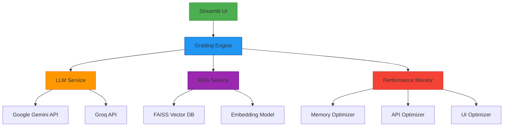

# Performance Stats Monitoring and RAG Enhancement Design

## 1. Overview

This design document addresses the performance monitoring and RAG (Retrieval-Augmented Generation) functionality issues in the geography assessment web application. The system currently experiences problems with performance monitoring and RAG document retrieval, which affects the grading process.

### 1.1 Problem Statement

The application is encountering issues with:
1. Performance monitoring not functioning correctly, as indicated by the error in `llm_service.py` at line 847 in the `get_performance_stats` method
2. RAG document retrieval not working properly, preventing effective grading of descriptive answers
3. The grading process failing to execute correctly due to these issues

### 1.2 Goals

1. Fix the performance monitoring functionality in the LLM service
2. Enhance RAG document retrieval to ensure proper reference material usage
3. Improve error handling and logging for better debugging
4. Optimize the grading process for better performance and reliability

## 2. System Architecture

### 2.1 Component Overview

The geography assessment system consists of several key components:



### 2.2 Data Flow

1. User uploads student data and rubric through the UI
2. UI triggers the grading process in the Grading Engine
3. For descriptive answers, RAG Service processes reference documents and retrieves relevant content
4. LLM Service generates prompts with rubric and references
5. LLM Service calls appropriate AI APIs (Gemini/Groq) for grading
6. Results are processed and returned to the UI
7. Performance Monitor tracks system metrics throughout the process

## 3. Performance Monitoring Issues

### 3.1 Current Issues

1. The `get_performance_stats` method in `LLMService` is incomplete, causing a syntax error
2. Performance monitoring is not properly integrated with the grading process
3. Memory optimization is not effectively triggered during long grading sessions

### 3.2 Root Causes

1. Missing closing brace in the `get_performance_stats` method in `llm_service.py`
2. Incomplete implementation of performance statistics collection
3. Lack of proper error handling in performance monitoring components

## 4. RAG Functionality Issues

### 4.1 Current Issues

1. RAG document processing may not be completing successfully
2. Retrieved references are not being properly incorporated into grading prompts
3. Chunking and embedding processes may have inefficiencies

### 4.2 Root Causes

1. Improper handling of uploaded reference files in the grading execution UI
2. Incomplete integration between RAG service and LLM service
3. Potential issues with document chunking parameters

## 5. Detailed Design Solutions

### 5.1 Fix Performance Monitoring in LLM Service

#### 5.1.1 Complete `get_performance_stats` Method

The incomplete `get_performance_stats` method in `llm_service.py` needs to be properly implemented. The issue is that the method is missing its closing brace. Here's the complete implementation:

```python
    def get_performance_stats(self) -> Dict[str, Any]:
        """Get LLM service performance statistics."""
        cache_info = self.generate_prompt.cache_info()
        
        return {
            "api_call_count": self.api_call_count,
            "total_processing_time": self.total_processing_time,
            "avg_processing_time": self.total_processing_time / max(self.api_call_count, 1),
            "cache_size": len(self.response_cache),
            "cache_hit_rate": self._calculate_cache_hit_rate(),
            "prompt_cache_info": {
                "hits": cache_info.hits,
                "misses": cache_info.misses,
                "maxsize": cache_info.maxsize,
                "currsize": cache_info.currsize
            }
        }
```

#### 5.1.2 Enhance Performance Integration

Add performance tracking to key LLM service methods:

1. In `call_gemini_api` and `call_groq_api` methods:
   - Add timing measurements
   - Track API response statistics
   - Integrate with performance monitor

2. In `grade_student_sequential` method:
   - Add detailed timing for each step
   - Track memory usage before and after grading

### 5.2 Improve RAG Functionality

#### 5.2.1 Enhance Document Processing

Improve the RAG service's document processing capabilities:

1. Add better error handling for document extraction:
   - Implement specific exception handling for PDF and DOCX processing
   - Add validation for file integrity before processing
   - Provide detailed error messages for troubleshooting

2. Implement more robust chunking algorithm:
   - Improve sentence-aware chunking to avoid breaking sentences
   - Adjust chunk size and overlap parameters (currently 500 chars with 50 overlap)
   - Add chunk quality scoring to filter out low-quality chunks

3. Add progress tracking for large document processing:
   - Implement progress callbacks for UI updates
   - Add estimated time remaining for document processing
   - Provide chunking statistics during processing

#### 5.2.2 Optimize Reference Integration

Ensure references are properly integrated into the grading process:

1. Modify the prompt generation to clearly incorporate RAG references:
   - Format references with clear numbering and source information
   - Limit the number of references included in prompts (currently 3)
   - Add similarity scores to help the LLM weigh reference importance

2. Add logging to verify reference usage:
   - Log retrieved references for each student answer
   - Track reference utilization in grading results
   - Monitor reference quality and relevance metrics

3. Implement reference quality scoring:
   - Add similarity threshold filtering (currently no threshold)
   - Implement relevance scoring based on content overlap
   - Add reference diversity metrics to avoid duplication

### 5.3 Error Handling and Logging Improvements

#### 5.3.1 Enhanced Error Categories

Implement more specific error categorization:
- API communication errors
- Document processing errors
- Performance-related errors
- Model-specific errors

#### 5.3.2 Detailed Logging

Add comprehensive logging throughout the grading process:
- Performance metrics at each step
- RAG retrieval effectiveness
- API response times and success rates
- Memory usage patterns

## 6. Implementation Approach

### 6.1 Fix Performance Monitoring

1. Complete the `get_performance_stats` method in `llm_service.py`
2. Add performance tracking to API calling methods
3. Integrate LLM service performance metrics with the global performance monitor
4. Add unit tests for performance monitoring functions

### 6.2 Enhance RAG Functionality

1. Improve document processing error handling in `rag_service.py`
2. Optimize document chunking algorithm
3. Enhance reference integration in prompt generation
4. Add logging to track RAG effectiveness

### 6.3 Error Handling and Logging

1. Implement enhanced error categorization
2. Add comprehensive logging throughout the system
3. Create debugging dashboard for performance metrics
4. Add unit tests for error handling

### 6.4 Testing and Optimization

1. Conduct integration testing
2. Optimize performance based on collected metrics
3. Validate RAG retrieval effectiveness
4. Document the implemented solutions

## 7. API Design

### 7.1 Performance Monitoring APIs

#### 7.1.1 Get LLM Service Performance Stats
```
GET /api/llm/performance
Response:
{
  "api_call_count": 42,
  "total_processing_time": 120.5,
  "avg_processing_time": 2.87,
  "cache_size": 25,
  "cache_hit_rate": 78.5,
  "prompt_cache_info": {
    "hits": 35,
    "misses": 10,
    "maxsize": 50,
    "currsize": 25
  }
}
```

#### 7.1.2 Get RAG Service Stats
```
GET /api/rag/stats
Response:
{
  "index_exists": true,
  "total_vectors": 1250,
  "total_chunks": 1250,
  "embedding_dimension": 768,
  "model_name": "nlpai-lab/KURE-v1"
}
```

### 7.2 RAG Enhancement APIs

#### 7.2.1 Process Reference Documents
```
POST /api/rag/process
Request:
{
  "files": ["file1.pdf", "file2.docx"]
}

Response:
{
  "success": true,
  "message": "Successfully processed 2 documents",
  "chunks_created": 42,
  "files_processed": ["file1.pdf", "file2.docx"]
}
```

#### 7.2.2 Search Relevant Content
```
POST /api/rag/search
Request:
{
  "query": "Student's answer content",
  "top_k": 3
}

Response:
{
  "results": [
    {
      "content": "Relevant reference content",
      "similarity_score": 0.85,
      "rank": 1,
      "metadata": {
        "source": "reference.pdf",
        "chunk_id": 15
      }
    }
  ]
}
```

## 8. Data Models

### 8.1 Performance Metrics Model

```python
@dataclass
class PerformanceMetrics:
    """Performance metrics tracking."""
    memory_usage_mb: float
    cpu_usage_percent: float
    api_call_count: int
    api_response_time_avg: float
    ui_render_time: float
    cache_hit_rate: float
    timestamp: datetime
```

### 8.2 RAG Document Chunk Model

```python
@dataclass
class DocumentChunk:
    """Represents a chunk of a reference document."""
    content: str
    source_file: str
    chunk_id: int
    embedding: Optional[List[float]] = None
    metadata: Dict[str, Any] = None
```

## 9. Testing Strategy

### 9.1 Unit Tests

1. Test performance statistics collection in LLM service
2. Test RAG document processing and chunking
3. Test error handling and categorization
4. Test API integration with mock services

### 9.2 Integration Tests

1. End-to-end grading process with performance monitoring
2. RAG integration with LLM service
3. Memory optimization during long grading sessions
4. Error recovery scenarios

### 9.3 Performance Tests

1. Measure API response times under load
2. Validate memory usage patterns
3. Test RAG retrieval effectiveness
4. Benchmark grading performance before and after optimizations

## 10. Monitoring and Observability

### 10.1 Key Metrics to Track

1. **API Performance**
   - Response times for Gemini and Groq APIs
   - Success rates for API calls
   - Rate limiting events

2. **RAG Effectiveness**
   - Number of chunks created per document
   - Similarity scores for retrieved content
   - Cache hit rates for document chunks
   - Reference utilization in grading prompts
   - Retrieval accuracy metrics

3. **System Performance**
   - Memory usage during grading sessions
   - CPU utilization patterns
   - UI rendering times

### 10.2 RAG Effectiveness Monitoring

Implement specific monitoring for RAG functionality:

1. **Retrieval Quality Metrics**:
   - Track average similarity scores for retrieved references
   - Monitor the distribution of similarity scores
   - Identify cases where no relevant references are found

2. **Reference Utilization Tracking**:
   - Measure how often retrieved references are actually used in grading
   - Track which references contribute most to successful grading
   - Monitor reference redundancy across documents

3. **Performance Impact Measurement**:
   - Compare grading quality with and without RAG references
   - Measure the time overhead of RAG processing
   - Evaluate the trade-off between accuracy improvement and processing time

### 10.2 Logging Strategy

1. Structured logging for performance metrics
2. Error logging with context and stack traces
3. Debug logging for RAG retrieval process
4. Audit logging for grading operations

## 11. Security Considerations

1. Protect API keys in configuration files
2. Validate file uploads to prevent malicious content
3. Implement rate limiting to prevent API abuse
4. Sanitize user inputs in prompts to prevent injection attacks

## 12. Deployment Considerations

1. Ensure environment variables are properly configured
2. Monitor system resources during deployment
3. Validate API connectivity after deployment
4. Test performance monitoring functionality in production environment

## 13. Configuration Parameters

### 13.1 Performance Monitoring Settings

Key configuration parameters that affect performance monitoring:

1. `ENABLE_PERFORMANCE_MONITORING`: Enable/disable performance monitoring
2. `PERFORMANCE_MONITORING_INTERVAL`: Interval (seconds) for monitoring updates
3. `MAX_MEMORY_USAGE_MB`: Memory threshold for optimization triggers
4. `API_CACHE_TTL_SECONDS`: Time-to-live for API response cache
5. `API_CACHE_MAX_SIZE`: Maximum size of API response cache

### 13.2 RAG Configuration Settings

Key configuration parameters that affect RAG functionality:

1. `CHUNK_SIZE`: Size of document chunks for RAG processing (default: 500)
2. `CHUNK_OVERLAP`: Overlap between document chunks (default: 50)
3. `TOP_K_RETRIEVAL`: Number of references to retrieve (default: 3)
4. `EMBEDDING_MODEL`: Model used for document embedding (default: nlpai-lab/KURE-v1)

## 14. Debugging and Troubleshooting

### 14.1 Common Issues and Solutions

1. **Performance Monitoring Not Starting**:
   - Verify `ENABLE_PERFORMANCE_MONITORING` is set to true in config
   - Check that performance monitoring interval is properly configured
   - Ensure required dependencies (psutil) are installed

2. **RAG Document Processing Failures**:
   - Validate file formats (PDF, DOCX support only)
   - Check file size limits (currently 50MB max)
   - Verify embedding model availability and loading

3. **Grading Process Failures**:
   - Check API key configuration for Gemini and Groq
   - Verify rubric and student data validation
   - Monitor memory usage during large batch processing

### 14.2 Diagnostic Tools

1. **Performance Dashboard**:
   - Use the built-in performance dashboard to monitor system metrics
   - Check memory, CPU, and API usage patterns
   - Identify bottlenecks in the grading process

2. **Logging Analysis**:
   - Enable debug logging for detailed troubleshooting
   - Analyze error patterns in grading failures
   - Track RAG retrieval effectiveness

3. **Unit Testing**:
   - Run specific tests for LLM service functionality
   - Validate RAG document processing independently
   - Test error handling and recovery mechanisms