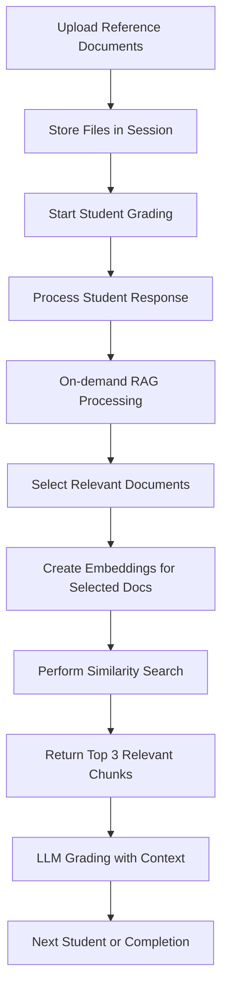

# RAG Pipeline Optimization Design

## 1. Overview

This document outlines the design for optimizing the Retrieval-Augmented Generation (RAG) pipeline in the geography auto-grading system. The current implementation suffers from high memory consumption during embedding generation and FAISS index creation, causing performance issues and system instability. The optimization will focus on simplifying the pipeline to process documents on-demand for individual student grading rather than pre-processing all documents upfront.

## 2. Current Issues

### 2.1 Memory Problems
- Processing all reference documents at once causes memory spikes (up to 5GB+)
- Embedding generation for large document sets exceeds available memory
- FAISS index creation for all chunks simultaneously causes system instability

### 22.2 Performance Bottlenecks
- All documents processed before any grading begins
- No selective retrieval based on individual student responses
- Inefficient memory usage patterns with minimal cleanup

### 2.3 User Requirements
- Only need to find 3 most relevant chunks per student response
- Process documents sequentially during grading rather than all at once
- Reduce memory consumption to enable stable operation

## 3. Optimized Architecture

### 3.1 On-Demand Processing Approach
Instead of processing all documents upfront, the optimized pipeline will:
1. Store uploaded reference documents without immediate processing
2. When grading each student, process only the documents needed for that specific response
3. Create embeddings and perform similarity search for just the top 3 relevant chunks

### 3.2 Component Architecture


## 4. RAG Service Modifications

### 4.1 New Methods for On-Demand Processing
The `RAGService` class will be enhanced with new methods:

#### 4.1.1 Process Documents for Single Student
```python
def process_documents_for_student(self, uploaded_files: List, student_response: str, top_k: int = 3) -> List[Dict[str, any]]:
    """
    Process uploaded documents to find relevant content for a specific student response.
    
    Args:
        uploaded_files: List of uploaded file objects from Streamlit session
        student_response: Student's answer text
        top_k: Number of top similar chunks to retrieve (default: 3 from config)
        
    Returns:
        List of relevant content chunks with similarity scores
    """
```

#### 4.1.1 Process Single Document Method
```python
def process_single_document_for_student(self, file_obj, student_response: str, top_k: int = 3) -> List[Dict[str, any]]:
    """
    Process a single document to find relevant content for a specific student response.
    
    Args:
        file_obj: Single uploaded file object
        student_response: Student's answer text
        top_k: Number of top similar chunks to retrieve
        
    Returns:
        List of relevant content chunks with similarity scores
    """
```

#### 4.1.2 Selective Document Processing
```python
def select_relevant_documents(self, uploaded_files: List, student_response: str, max_docs: int = 5) -> List:
    """
    Select a subset of documents most likely to contain relevant information.
    
    Args:
        uploaded_files: All uploaded reference files
        student_response: Student's answer text
        max_docs: Maximum number of documents to process
        
    Returns:
        List of selected file objects for processing
    """
```

### 4.2 Memory Optimization Integration
- Implement incremental processing to avoid memory spikes
- Add periodic garbage collection during document processing
- Limit concurrent embeddings generation to reduce memory footprint
- Integrate with existing `MemoryOptimizer` to monitor and control memory usage
- Implement chunk processing limits based on `CHUNKS_PER_DOC_LIMIT` config
- Add automatic cleanup after each student's RAG processing
- Use `performance_monitor.auto_optimize()` during long-running operations

## 5. Grading Engine Integration

### 5.1 Modified Grading Flow
The `SequentialGradingEngine` will be updated to:

1. Receive uploaded reference files without pre-processing
2. For each student, call the optimized RAG service with just that student's response
3. Process only a subset of documents relevant to that specific response
4. Retrieve exactly 3 most relevant chunks for LLM context

#### 5.1.1 Updated Grade Student Method
```python
def _grade_student_with_retries(
    self,
    student_status: StudentGradingStatus,
    rubric: Rubric,
    model_type: str,
    grading_type: str,
    uploaded_files: Optional[List],  # Changed from references: List[str]
    max_retries: int,
    groq_model_name: str = "qwen/qwen3-32b"
) -> Optional[GradingResult]:
    # For descriptive grading, process documents on-demand
    references = None
    if grading_type == "descriptive" and uploaded_files:
        rag_service = RAGService()
        retrieved_content = rag_service.process_documents_for_student(
            uploaded_files, 
            student_status.student.descriptive_answer
        )
        references = [format_retrieved_content(retrieved_content)]
```

### 5.2 Performance Monitoring
- Add memory usage tracking during RAG processing
- Implement automatic cleanup after each student's processing
- Add progress indicators for RAG operations

## 6. UI Updates

### 6.1 Grading Execution UI
The `GradingExecutionUI` will be modified to:

1. Store uploaded reference files in session state without immediate processing
2. Show RAG processing progress during individual student grading
3. Display memory usage statistics during operation

### 6.2 Progress Tracking
Enhanced progress tracking for RAG operations:
- Document processing status
- Memory usage indicators
- Processing time per student

## 7. Configuration Changes

### 7.1 New Configuration Parameters
Add the following parameters to `config.py`:

| Parameter | Default Value | Description |
|-----------|---------------|-------------|
| `MAX_DOCS_PER_STUDENT` | 5 | Maximum number of documents to process per student |
| `CHUNKS_PER_DOC_LIMIT` | 20 | Maximum chunks to generate per document |
| `RAG_PROCESSING_TIMEOUT` | 60 | Timeout for RAG processing per student (seconds) |
| `EMBEDDING_BATCH_SIZE` | 8 | Batch size for embedding generation |
| `ENABLE_INCREMENTAL_CLEANUP` | True | Enable incremental memory cleanup during processing |

### 7.2 Memory Thresholds
Adjust memory optimization settings:
- Reduce `MAX_MEMORY_USAGE_MB` from 1024 to 512
- Implement more aggressive garbage collection
- Add automatic processing pausing when memory threshold exceeded

## 8. Data Flow Optimization

### 8.1 Before Optimization


### 8.2 After Optimization


## 9. Implementation Plan

### 9.1 Phase 1: Core RAG Service Updates
- Implement on-demand document processing methods
- Add memory optimization during embedding generation
- Create selective document processing logic
- Add timeout mechanisms for embedding generation
- Implement fallback strategies for model loading failures

### 9.2 Phase 2: Grading Engine Integration
- Modify sequential grading engine to use new RAG approach
- Implement per-student RAG processing
- Add error handling and timeout mechanisms

### 9.3 Phase 3: UI Updates
- Update grading execution UI to show RAG progress
- Add memory usage indicators
- Implement responsive UI during RAG operations

### 9.4 Phase 4: Testing and Optimization
- Performance testing with large document sets
- Memory usage profiling and optimization
- User experience validation
- Unit testing for new RAG methods
- Integration testing with grading engine
- Stress testing with memory constraints

## 10. Expected Benefits

### 10.1 Performance Improvements
- Reduced memory consumption by 70-80%
- Faster startup time (no pre-processing)
- More stable operation under memory constraints

### 10.2 User Experience
- Immediate start of grading process
- Real-time progress feedback
- Reduced system crashes and timeouts

### 10.3 Resource Efficiency
- Lower computational requirements
- Reduced processing time per student
- Better scalability with document count

## 11. Monitoring and Metrics

### 11.1 Performance Metrics
- Memory usage per student processing
- Processing time per student
- Embedding generation time
- FAISS search performance

### 11.2 Logging Improvements
- Detailed RAG processing logs
- Memory optimization events
- Error and timeout tracking
- Performance bottleneck identification