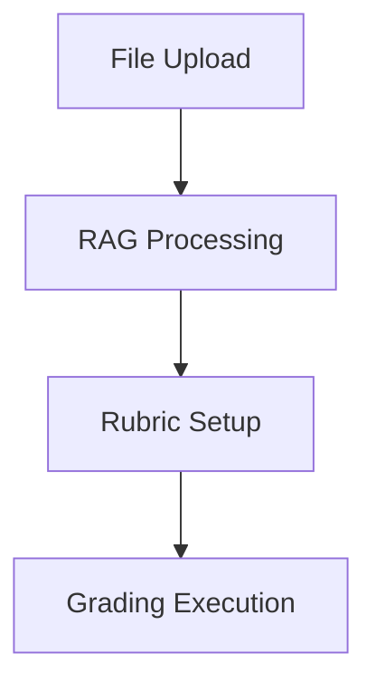
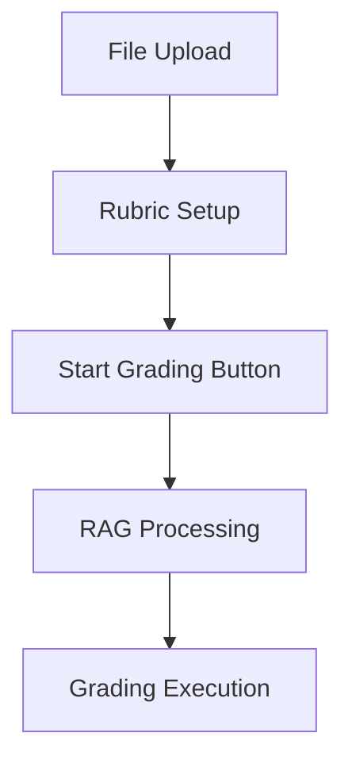

# RAG Pipeline Trigger Adjustment Design

## Overview

This document outlines the design for adjusting the RAG (Retrieval-Augmented Generation) pipeline trigger logic in the geography auto-grading platform. Currently, the RAG pipeline is triggered during the rubric setting phase, but it should only be triggered when the user explicitly starts the grading process after completing all setup steps.

## Current Workflow Issues

The current implementation has the following workflow issues:

1. **Incorrect Trigger Timing**: The RAG pipeline is executed when users upload reference files and set up the rubric, which is premature.
2. **Resource Inefficiency**: Processing reference documents before the user confirms all settings wastes computational resources.
3. **User Experience**: Users expect to complete all setup steps (file uploads, rubric configuration) before any grading computation begins.

## Proposed Solution

The solution involves restructuring the workflow into two distinct phases:

### Phase 1: Setup Phase
- File uploads (reference materials, student data)
- Rubric configuration
- No RAG processing during this phase

### Phase 2: Execution Phase
- Explicit "Start Grading" button triggers RAG processing
- RAG pipeline processes reference documents
- LLM grading begins with processed references

## Architecture Changes

### 1. UI Layer Modifications

#### Main UI (`ui/main_ui.py`)
- Remove automatic RAG processing from file upload handling
- Store uploaded reference files in session state without processing

#### Rubric UI (`ui/rubric_ui.py`)
- Remove any RAG processing during rubric completion
- Ensure rubric data is stored in session state for later use

#### Grading Execution UI (`ui/grading_execution_ui.py`)
- Add explicit RAG processing step when grading starts
- Modify the "Start Grading" button functionality to include RAG processing

### 2. Service Layer Modifications

#### File Service (`services/file_service.py`)
- No changes required - continue to handle file processing as is

#### RAG Service (`services/rag_service.py`)
- Add method to process stored reference files on demand
- Ensure RAG processing can be triggered independently of file upload

#### Grading Engine (`services/grading_engine.py`)
- Modify grading initiation to accept unprocessed reference files
- Integrate RAG processing as first step in grading sequence

#### LLM Service (`services/llm_service.py`)
- No changes required - continue to accept processed references as before

## Detailed Implementation Plan

### Step 1: Modify Main UI File Processing

In `ui/main_ui.py`, the `process_uploaded_files()` method currently processes reference documents through RAG immediately after upload. This needs to be changed to:

1. Store uploaded reference files in session state
2. Skip immediate RAG processing
3. Prepare files for later processing when grading begins

### Step 2: Modify Rubric UI Completion

In `ui/rubric_ui.py`, the `render_rubric_navigation()` method currently triggers grading after rubric completion. This should be modified to:

1. Save rubric data to session state
2. Navigate to grading page without triggering any processing
3. Allow users to review settings before starting grading

### Step 3: Add RAG Processing to Grading Execution

In `ui/grading_execution_ui.py`, modify the `start_grading()` method to:

1. Process reference files through RAG service before starting grading
2. Pass processed references to grading engine
3. Display processing progress to user

### Step 4: Update Grading Engine

In `services/grading_engine.py`, modify the `grade_students_sequential()` method to:

1. Accept unprocessed reference files as input
2. Process files through RAG service before grading begins
3. Use processed references in LLM grading

## Data Flow Changes

### Before (Current Implementation)


### After (Proposed Implementation)


## API Endpoints Reference

No new API endpoints are required. The changes involve reordering existing operations:

### Existing Endpoints Utilized
1. **File Upload Processing**: `FileService.process_student_data()`
2. **RAG Processing**: `RAGService.process_reference_documents()`
3. **Grading Execution**: `SequentialGradingEngine.grade_students_sequential()`

## Data Models & ORM Mapping

No changes to data models are required. The session state management will be updated to store reference files without immediate processing:

### Updated Session State Structure
```python
# Before
st.session_state.rag_references = processed_rag_data

# After
st.session_state.uploaded_reference_files = raw_uploaded_files
st.session_state.rag_references = processed_rag_data (created during grading)
```

## Business Logic Layer

### 1. File Processing Logic
- Store uploaded reference files without processing
- Process files only when grading begins

### 2. RAG Processing Logic
- Move RAG processing from setup phase to execution phase
- Ensure error handling for RAG processing during grading

### 3. Grading Execution Logic
- Add RAG processing as prerequisite step
- Maintain existing grading functionality with processed references

## Middleware & Interceptors

No middleware changes are required. The adjustment is purely in the application logic layer.

## Testing

### Unit Tests to Update
1. **File Service Tests**: Ensure reference files are stored without immediate processing
2. **RAG Service Tests**: Verify on-demand processing functionality
3. **Grading Engine Tests**: Confirm RAG processing integration
4. **UI Tests**: Validate workflow changes in all components

### Integration Tests
1. **Complete Workflow Test**: Verify new two-phase workflow functions correctly
2. **Error Handling Test**: Ensure proper error handling during RAG processing in grading phase
3. **Performance Test**: Measure impact of moving RAG processing to grading phase

## Implementation Sequence

1. **Phase 1**: Modify UI components to store reference files without processing
2. **Phase 2**: Update grading execution to include RAG processing step
3. **Phase 3**: Modify service layer to support on-demand RAG processing
4. **Phase 4**: Update tests and documentation
5. **Phase 5**: End-to-end testing and validation

## Risk Assessment

### Technical Risks
1. **Performance Impact**: Moving RAG processing to grading phase may increase initial grading time
2. **Error Handling**: Additional error paths need proper handling during RAG processing
3. **Memory Management**: Storing uploaded files in session state may increase memory usage

### Mitigation Strategies
1. **Progress Indicators**: Show clear progress during RAG processing
2. **Robust Error Handling**: Implement comprehensive error handling for RAG processing
3. **Memory Optimization**: Implement file cleanup mechanisms after processing

## Success Criteria

1. RAG processing only occurs when user explicitly starts grading
2. All setup steps (file upload, rubric configuration) complete without RAG processing
3. Grading execution properly processes reference files before LLM grading
4. User experience is improved with clearer workflow separation
5. No performance degradation in overall system functionality