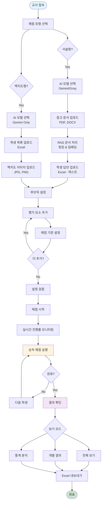
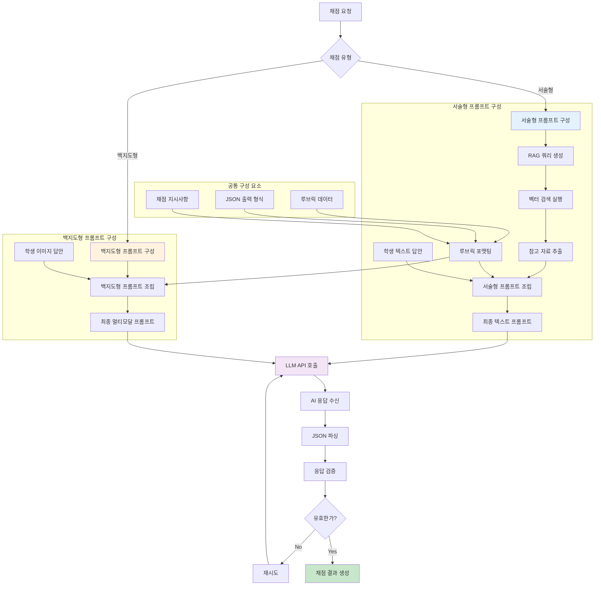
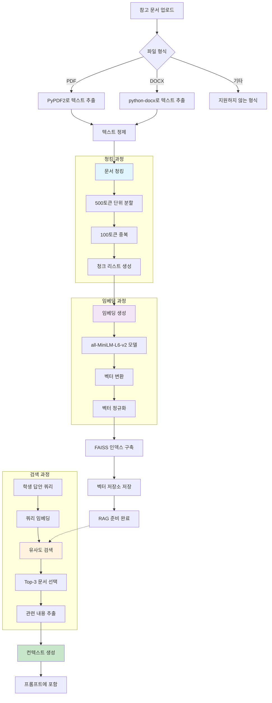
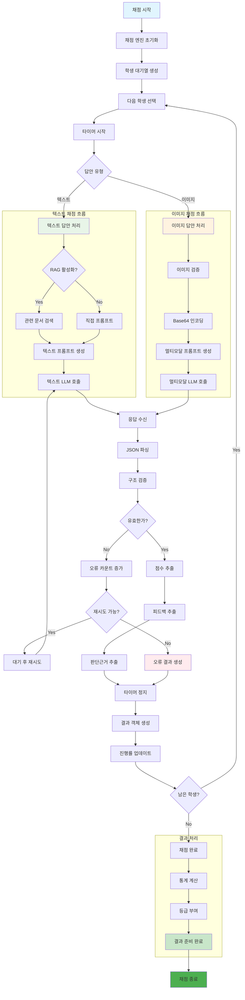

# 🏗️ 지리과 자동 채점 플랫폼 아키텍처

이 문서는 지리과 자동 채점 플랫폼의 전체 시스템 아키텍처와 데이터 흐름을 설명합니다.

## 1. 전체 프로젝트 구조

```mermaid
flowchart TD
    %% Frontend Layer
    subgraph "🖥️ Frontend Layer"
        UI[Streamlit Web UI]
        MAIN[main_ui.py<br/>메인 인터페이스]
        RUBRIC[rubric_ui.py<br/>루브릭 설정]
        EXEC[grading_execution_ui.py<br/>채점 실행]
        RESULT[results_ui.py<br/>결과 표시]
        PROGRESS[enhanced_progress_display.py<br/>진행률 표시]
        ERROR[error_display_ui.py<br/>오류 표시]
        STATUS[status_display_ui.py<br/>상태 표시]
    end
    
    %% Application Entry Point
    subgraph "🚀 Application Entry"
        APP[app.py<br/>메인 진입점]
        CONFIG[config.py<br/>환경설정 관리]
    end
    
    %% Core Services Layer
    subgraph "⚙️ Core Services"
        LLM[llm_service.py<br/>AI 모델 통합]
        RAG[rag_service.py<br/>문서 검색]
        GRADING[grading_engine.py<br/>채점 엔진]
        FILE[file_service.py<br/>파일 처리]
        EXPORT[export_service.py<br/>결과 내보내기]
        MSG[status_message_manager.py<br/>상태 메시지]
    end
    
    %% Data Models Layer
    subgraph "📊 Data Models"
        STUDENT[student_model.py<br/>학생 정보]
        RUBRICM[rubric_model.py<br/>루브릭 모델]
        RESULTM[result_model.py<br/>채점 결과]
        PROGRESS_M[enhanced_progress_model.py<br/>진행률 모델]
        STATUS_M[status_message_model.py<br/>상태 메시지]
    end
    
    %% Utilities Layer
    subgraph "🛠️ Utilities"
        PROMPT[prompt_utils.py<br/>프롬프트 생성]
        EMBED[embedding_utils.py<br/>임베딩 처리]
        ERR[error_handler.py<br/>오류 처리]
    end
    
    %% External Services
    subgraph "🌐 External Services"
        GEMINI[Google Gemini API<br/>멀티모달 AI]
        GROQ[Groq API<br/>고속 텍스트 AI]
        HF[HuggingFace Models<br/>임베딩 모델]
    end
    
    %% Data Storage
    subgraph "💾 Data Storage"
        FAISS[(FAISS Vector Store<br/>벡터 검색)]
        TEMP[(Temporary Files<br/>임시 파일)]
        EXCEL[(Excel Output<br/>결과 파일)]
    end
    
    %% Connections - Top to Bottom Flow
    UI --> APP
    MAIN --> APP
    RUBRIC --> APP
    EXEC --> APP
    RESULT --> APP
    PROGRESS --> APP
    ERROR --> APP
    STATUS --> APP
    
    APP --> CONFIG
    APP --> LLM
    APP --> RAG
    APP --> GRADING
    APP --> FILE
    APP --> EXPORT
    APP --> MSG
    
    LLM --> PROMPT
    LLM --> GEMINI
    LLM --> GROQ
    
    RAG --> EMBED
    RAG --> HF
    RAG --> FAISS
    
    GRADING --> STUDENT
    GRADING --> RUBRICM
    GRADING --> RESULTM
    GRADING --> PROGRESS_M
    GRADING --> STATUS_M
    
    FILE --> TEMP
    EXPORT --> EXCEL
    
    PROMPT --> ERR
    EMBED --> ERR
    
    %% Styling
    classDef frontend fill:#e3f2fd,stroke:#1976d2,stroke-width:2px
    classDef app fill:#f3e5f5,stroke:#7b1fa2,stroke-width:2px
    classDef service fill:#e8f5e8,stroke:#388e3c,stroke-width:2px
    classDef model fill:#fff3e0,stroke:#f57c00,stroke-width:2px
    classDef util fill:#fce4ec,stroke:#c2185b,stroke-width:2px
    classDef external fill:#e0f2f1,stroke:#00695c,stroke-width:2px
    classDef storage fill:#f1f8e9,stroke:#558b2f,stroke-width:2px
    
    class UI,MAIN,RUBRIC,EXEC,RESULT,PROGRESS,ERROR,STATUS frontend
    class APP,CONFIG app
    class LLM,RAG,GRADING,FILE,EXPORT,MSG service
    class STUDENT,RUBRICM,RESULTM,PROGRESS_M,STATUS_M model
    class PROMPT,EMBED,ERR util
    class GEMINI,GROQ,HF external
    class FAISS,TEMP,EXCEL storage
```

## 2. 플랫폼 이용자 흐름

## 3. 프롬프트 구성 흐름

## 4. RAG 파이프라인 작동 방식

## 5. 채점 로직

## 시스템 특징

### 🔧 **아키텍처 설계 원칙**
- **모듈 분리**: UI, Service, Model 계층 명확 분리
- **확장성**: 새로운 AI 모델 및 채점 유형 추가 용이
- **안정성**: 오류 처리 및 재시도 메커니즘
- **성능**: 순차 처리 및 진행률 추적

### 🚀 **핵심 기술 스택**
- **Frontend**: Streamlit (Python 웹 UI)
- **AI Models**: Google Gemini, Groq
- **Vector Search**: FAISS + HuggingFace Embeddings
- **Data Processing**: Pandas, OpenPyXL
- **Document Processing**: PyPDF2, python-docx

### 📊 **데이터 흐름**
1. **입력**: 문서 → 청킹 → 임베딩 → 벡터 저장
2. **처리**: 쿼리 → 검색 → 프롬프트 → AI 추론
3. **출력**: 결과 → 검증 → 저장 → 시각화

### 🔒 **보안 및 설정**
- **API 키 관리**: 환경변수 및 Streamlit Secrets
- **파일 처리**: 임시 파일 자동 정리
- **오류 처리**: 체계적인 예외 처리 및 로깅