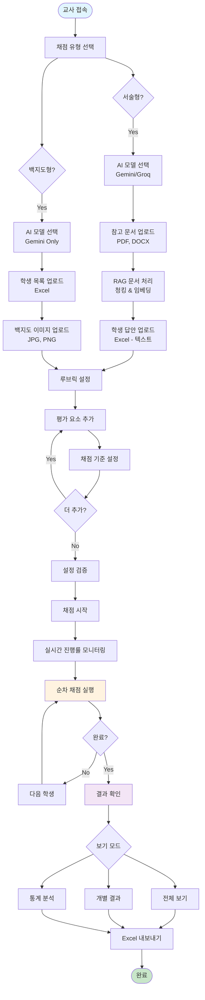
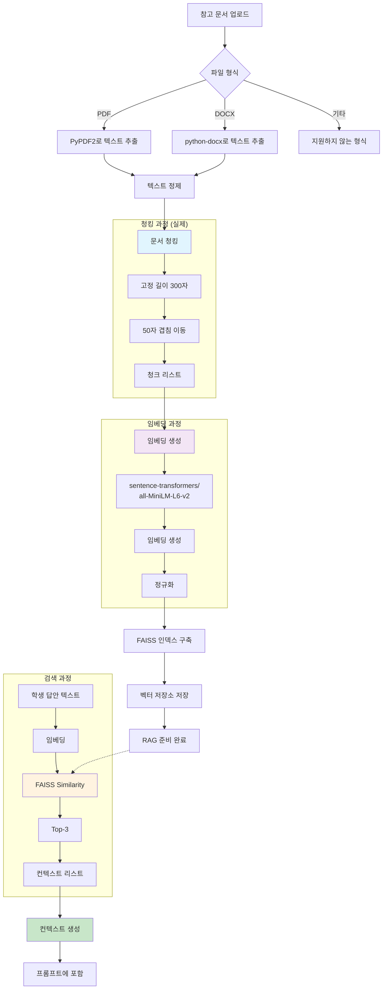
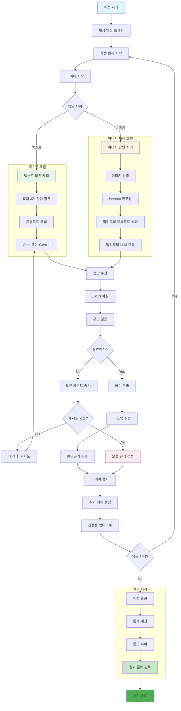
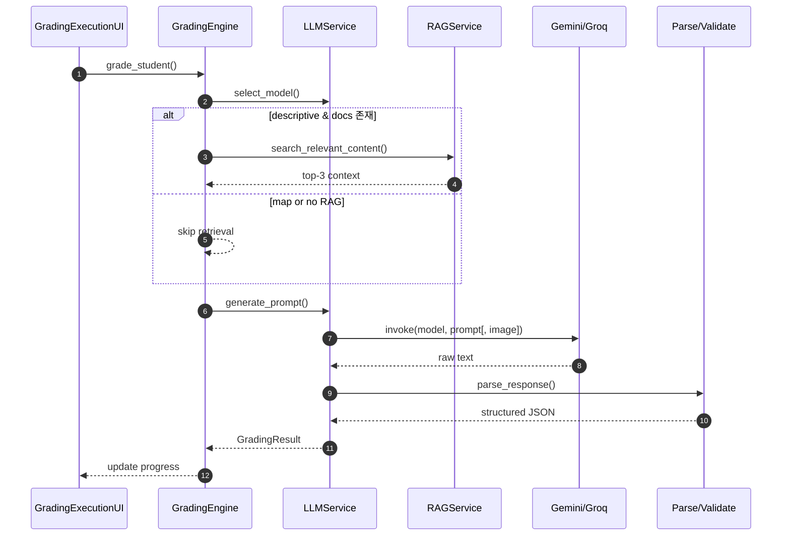
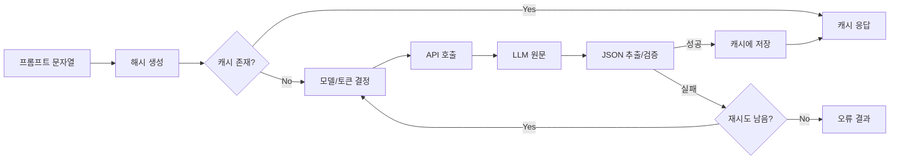
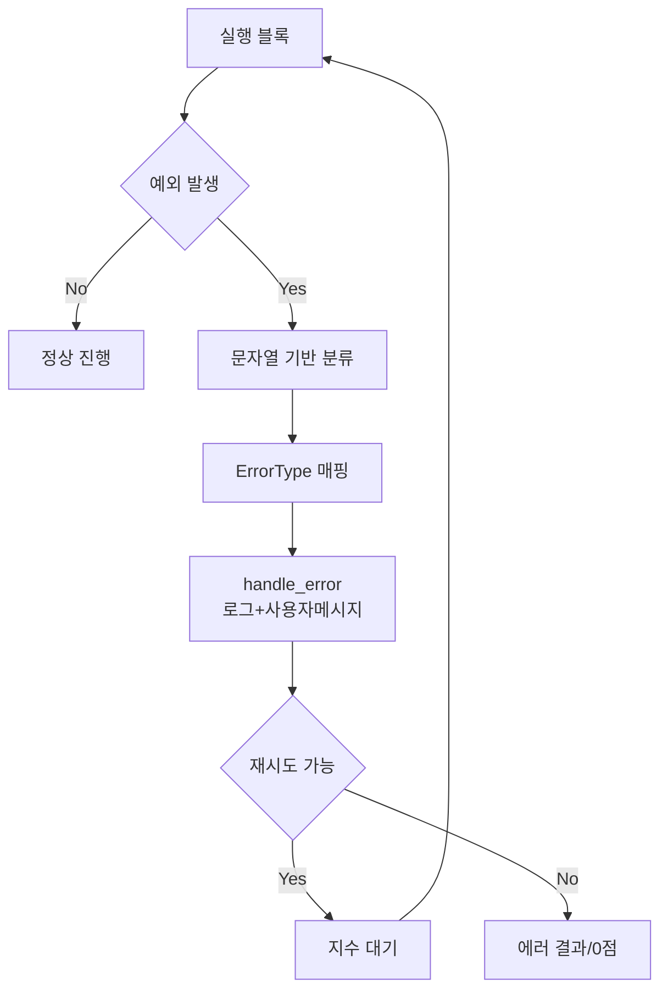
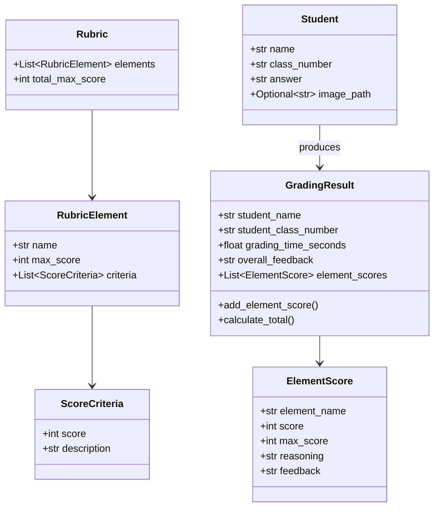
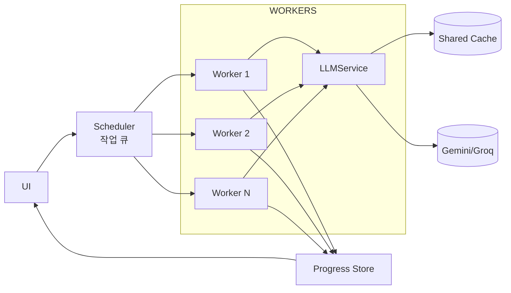

# 🏗️ 지리과 자동 채점 플랫폼 아키텍처 (업데이트)

이 문서는 최신 코드 기준(동적 Groq 모델 선택, Gemini 2.5 Flash 고정, 사용되지 않는 `prompt_utils.py` 정리 상태)을 반영한 전체 시스템 아키텍처와 데이터 흐름을 설명합니다.

## 1. 전체 프로젝트 구조

```mermaid
flowchart TD
    %% Frontend Layer
    subgraph "🖥️ Frontend Layer"
        MAIN[main_ui.py<br/>모델/파일/루브릭 설정]
        EXEC[grading_execution_ui.py<br/>채점 실행 & 진행률]
        RESULT[results_ui.py<br/>결과 표시]
        RUBRIC[rubric_ui.py<br/>루브릭 편집]
    end

    %% Entry / Config
    subgraph "🚀 Entry & Config"
        APP[app.py<br/>진입 & 라우팅]
        CONFIG[config.py<br/>환경/키/튜닝값]
    end

    %% Core Services
    subgraph "⚙️ Core Services"
        LLM[llm_service.py<br/>LLM 통합 & 프롬프트]
        RAG[rag_service.py<br/>문서 임베딩 검색]
        GRADING[grading_engine.py<br/>채점 시퀀스]
        FILE[file_service.py<br/>입력 검증]
        EXPORT[export_service.py<br/>결과 내보내기]
    end

    %% Data Models
    subgraph "📊 Data Models"
        STUDENT[student_model.py]
        RUBRICM[rubric_model.py]
        RESULTM[result_model.py]
    end

    %% Utilities (활성)
    subgraph "🛠️ Utilities"
        EMBED_UTIL[embedding_utils.py]
        ERR[error_handler.py]
        PROMPT_DEPRECATED[prompt_utils.py (미사용)]
    end

    %% External APIs
    subgraph "🌐 External"
        GEMINI[Gemini 2.5 Flash]
        GROQ[Groq (Qwen3 / GPT-OSS)]
        HF[HuggingFace<br/>sentence-transformers]
    end

    %% Storage
    subgraph "💾 Storage"
        FAISS[(FAISS Vector Store)]
        TEMP[(Temp Files)]
        EXCEL[(Exported Excel)]
    end

    MAIN --> APP
    RUBRIC --> APP
    EXEC --> APP
    RESULT --> APP

    APP --> CONFIG
    APP --> GRADING
    APP --> FILE
    APP --> EXPORT

    GRADING --> LLM
    GRADING --> RAG
    GRADING --> STUDENT
    GRADING --> RUBRICM
    GRADING --> RESULTM

    LLM --> GEMINI
    LLM --> GROQ
    RAG --> FAISS
    RAG --> HF
    FILE --> TEMP
    EXPORT --> EXCEL

    LLM --> ERR
    RAG --> ERR
    GRADING --> ERR

    EMBED_UTIL --> RAG
    PROMPT_DEPRECATED -. 참조 제거 .- LLM

    classDef deprecated fill:#eeeeee,stroke:#999,stroke-dasharray:4 2,color:#666
    class PROMPT_DEPRECATED deprecated
```

## 2. 플랫폼 이용자 흐름

```mermaid
flowchart TD
    START([교사 접속]) --> SELECT[채점 유형 선택]
    
    SELECT --> DESC{서술형?}
    SELECT --> MAP{백지도형?}
    
    DESC -->|Yes| MODEL_D[AI 모델 선택<br/>Gemini/Groq]
    MAP -->|Yes| MODEL_M[AI 모델 선택<br/>Gemini Only]
    
    MODEL_D --> REF_UPLOAD[참고 문서 업로드<br/>PDF, DOCX]
    MODEL_M --> STUDENT_LIST[학생 목록 업로드<br/>Excel]
    
    REF_UPLOAD --> RAG_PROC[RAG 문서 처리<br/>청킹 & 임베딩]
    RAG_PROC --> STUDENT_ANS_D[학생 답안 업로드<br/>Excel - 텍스트]
    
    STUDENT_LIST --> IMAGE_UPLOAD[백지도 이미지 업로드<br/>JPG, PNG]
    
    STUDENT_ANS_D --> RUBRIC[루브릭 설정]
    IMAGE_UPLOAD --> RUBRIC
    
    RUBRIC --> ADD_ELEMENT[평가 요소 추가]
    ADD_ELEMENT --> ADD_CRITERIA[채점 기준 설정]
    ADD_CRITERIA --> MORE{더 추가?}
    MORE -->|Yes| ADD_ELEMENT
    MORE -->|No| VALIDATE[설정 검증]
    
    VALIDATE --> START_GRADING[채점 시작]
    START_GRADING --> PROGRESS[실시간 진행률 모니터링]
    
    PROGRESS --> GRADING_LOOP[순차 채점 실행]
    GRADING_LOOP --> STUDENT_DONE{완료?}
    STUDENT_DONE -->|No| NEXT_STUDENT[다음 학생]
    NEXT_STUDENT --> GRADING_LOOP
    
    STUDENT_DONE -->|Yes| RESULTS[결과 확인]
    
    RESULTS --> VIEW_MODE{보기 모드}
    VIEW_MODE --> OVERVIEW[전체 보기]
    VIEW_MODE --> INDIVIDUAL[개별 결과]
    VIEW_MODE --> ANALYTICS[통계 분석]
    
    OVERVIEW --> EXPORT[Excel 내보내기]
    INDIVIDUAL --> EXPORT
    ANALYTICS --> EXPORT
    
    EXPORT --> END([완료])
    
    style START fill:#e1f5fe
    style END fill:#c8e6c9
    style GRADING_LOOP fill:#fff3e0
    style RESULTS fill:#f3e5f5
```

## 3. 프롬프트 구성 흐름 (현재 구현)

프롬프트 생성 로직은 `llm_service.py` 의 `generate_prompt()` 안에 통합되어 있으며, 별도 `prompt_utils.py` 는 더 이상 사용되지 않습니다.

```mermaid
flowchart TD
    START[채점 요청] --> TYPE{채점 유형}
    
    TYPE -->|서술형| DESC_FLOW[서술형 프롬프트 구성]
    TYPE -->|백지도형| MAP_FLOW[백지도형 프롬프트 구성]
    
    subgraph "서술형 (Descriptive)"
        DESC_FLOW --> RAG_SEARCH[Top-K 벡터 검색 (k=3)]
        RAG_SEARCH --> REF_CONTENT[관련 컨텍스트 정리]
        REF_CONTENT --> DESC_PROMPT[루브릭 + 참고 + 답안 통합]
        RUBRIC_FORMAT --> DESC_PROMPT
        STUDENT_TEXT[학생 텍스트 답안] --> DESC_PROMPT
        DESC_PROMPT --> DESC_FINAL[JSON 요구 포맷 포함 프롬프트]
    end
    
    subgraph "백지도형 프롬프트 구성"
        MAP_FLOW --> MAP_PROMPT[백지도형 프롬프트 조립]
        RUBRIC_FORMAT --> MAP_PROMPT
        STUDENT_IMAGE[학생 이미지 답안] --> MAP_PROMPT
        
        MAP_PROMPT --> MAP_FINAL[최종 멀티모달 프롬프트]
    end
    
    subgraph "공통 구성 요소"
        RUBRIC_DATA[루브릭 요소/기준]
        OUTPUT_FORMAT[출력 JSON 스키마]
        INSTRUCTIONS[채점 역할 지시]
        RUBRIC_DATA --> RUBRIC_FORMAT[루브릭 문자열화]
        OUTPUT_FORMAT --> RUBRIC_FORMAT
        INSTRUCTIONS --> RUBRIC_FORMAT
    end
    
    DESC_FINAL --> LLM_CALL[LLM API 호출]
    MAP_FINAL --> LLM_CALL
    
    LLM_CALL --> RESPONSE[AI 응답 수신]
    RESPONSE --> PARSE[JSON 파싱]
    PARSE --> VALIDATE[응답 검증]
    
    VALIDATE --> VALID{유효한가?}
    VALID -->|No| RETRY[재시도]
    RETRY --> LLM_CALL
    
    VALID -->|Yes| RESULT[채점 결과 생성]
    
    style DESC_FLOW fill:#e3f2fd
    style MAP_FLOW fill:#fff3e0
    style LLM_CALL fill:#f3e5f5
    style RESULT fill:#c8e6c9
```

## 4. RAG 파이프라인 작동 방식 (실제 코드 기준)

`rag_service.py` 는 LangChain `FAISS` + `HuggingFaceEmbeddings(model_name="sentence-transformers/all-MiniLM-L6-v2")` 를 사용합니다.

`config.py` 의 `EMBEDDING_MODEL = nlpai-lab/KURE-v1` 은 현재 RAG 서비스에서는 직접 사용되지 않으며(잠재적 향후 교체 포인트), 문서화된 기본 파이프라인과 실제 구현 간 차이를 아래에 명확히 표기합니다.

```mermaid
flowchart TD
    START[참고 문서 업로드] --> FILE_CHECK{파일 형식}
    
    FILE_CHECK -->|PDF| PDF_EXTRACT[PyPDF2로 텍스트 추출]
    FILE_CHECK -->|DOCX| DOCX_EXTRACT[python-docx로 텍스트 추출]
    FILE_CHECK -->|기타| ERROR[지원하지 않는 형식]
    
    PDF_EXTRACT --> CLEAN[텍스트 정제]
    DOCX_EXTRACT --> CLEAN
    
    CLEAN --> CHUNK[문서 청킹]
    
    subgraph "청킹 과정 (실제)"
        CHUNK --> SPLIT[고정 길이 300자]
        SPLIT --> OVERLAP[50자 겹침 이동]
        OVERLAP --> CHUNK_LIST[청크 리스트]
    end
    
    CHUNK_LIST --> EMBED[임베딩 생성]
    
    subgraph "임베딩 과정"
        EMBED --> MODEL[sentence-transformers/<br/>all-MiniLM-L6-v2]
        MODEL --> VECTORS[임베딩 생성]
        VECTORS --> NORM[정규화]
    end
    
    NORM --> FAISS_BUILD[FAISS 인덱스 구축]
    FAISS_BUILD --> STORE[벡터 저장소 저장]
    
    STORE --> READY[RAG 준비 완료]
    
    subgraph "검색 과정"
            QUERY[학생 답안 텍스트] --> QUERY_EMBED[임베딩]
            QUERY_EMBED --> SEARCH[FAISS Similarity]
            SEARCH --> TOP_K[Top-3]
            TOP_K --> RETRIEVE[컨텍스트 리스트]
    end
    
    READY -.-> SEARCH
    RETRIEVE --> CONTEXT[컨텍스트 생성]
    CONTEXT --> PROMPT[프롬프트에 포함]
    
    style CHUNK fill:#e1f5fe
    style EMBED fill:#f3e5f5
    style SEARCH fill:#fff3e0
    style CONTEXT fill:#c8e6c9
```

## 5. 채점 로직 (Sequential)

```mermaid
flowchart TD
    START[채점 시작] --> INIT[채점 엔진 초기화]
    INIT --> NEXT_STUDENT[학생 반복 시작]
    NEXT_STUDENT --> TIMER_START[타이머 시작]
    
    TIMER_START --> ANSWER_TYPE{답안 유형}
    
    ANSWER_TYPE -->|텍스트| TEXT_PROCESS[텍스트 답안 처리]
    ANSWER_TYPE -->|이미지| IMAGE_PROCESS[이미지 답안 처리]
    
    subgraph "텍스트 채점"
        TEXT_PROCESS --> RAG_SEARCH[최대 3개 관련 청크]
        RAG_SEARCH --> TEXT_PROMPT[프롬프트 조립]
        TEXT_PROMPT --> TEXT_LLM[Groq 또는 Gemini]
    end
    
    subgraph "이미지 채점 흐름"
        IMAGE_PROCESS --> IMAGE_VALID[이미지 검증]
        IMAGE_VALID --> IMAGE_ENCODE[Base64 인코딩]
        IMAGE_ENCODE --> IMAGE_PROMPT[멀티모달 프롬프트 생성]
        IMAGE_PROMPT --> IMAGE_LLM[멀티모달 LLM 호출]
    end
    
    TEXT_LLM --> RESPONSE_RECV[응답 수신]
    IMAGE_LLM --> RESPONSE_RECV
    
    RESPONSE_RECV --> JSON_PARSE[JSON 파싱]
    JSON_PARSE --> STRUCT_VALID[구조 검증]
    
    STRUCT_VALID --> VALID_CHECK{유효한가?}
    VALID_CHECK -->|No| ERROR_COUNT[오류 카운트 증가]
    ERROR_COUNT --> RETRY_CHECK{재시도 가능?}
    RETRY_CHECK -->|Yes| WAIT[대기 후 재시도]
    WAIT --> TEXT_LLM
    RETRY_CHECK -->|No| ERROR_RESULT[오류 결과 생성]
    
    VALID_CHECK -->|Yes| SCORE_EXTRACT[점수 추출]
    SCORE_EXTRACT --> FEEDBACK_EXTRACT[피드백 추출]
    FEEDBACK_EXTRACT --> REASONING_EXTRACT[판단근거 추출]
    
    REASONING_EXTRACT --> TIMER_STOP[타이머 정지]
    ERROR_RESULT --> TIMER_STOP
    
    TIMER_STOP --> RESULT_CREATE[결과 객체 생성]
    RESULT_CREATE --> PROGRESS_UPDATE[진행률 업데이트]
    
    PROGRESS_UPDATE --> MORE_STUDENTS{남은 학생?}
    MORE_STUDENTS -->|Yes| NEXT_STUDENT
    MORE_STUDENTS -->|No| GRADING_COMPLETE[채점 완료]
    
    subgraph "결과 처리"
        GRADING_COMPLETE --> STATS_CALC[통계 계산]
        STATS_CALC --> GRADE_ASSIGN[등급 부여]
        GRADE_ASSIGN --> RESULTS_READY[결과 준비 완료]
    end
    
    RESULTS_READY --> END[채점 종료]
    
    style START fill:#e1f5fe
    style TEXT_PROCESS fill:#e8f5e8
    style IMAGE_PROCESS fill:#fff3e0
    style ERROR_RESULT fill:#ffebee
    style RESULTS_READY fill:#c8e6c9
    style END fill:#4caf50
```

## 6. 모델 선택 및 토큰 관리

| 항목 | 내용 |
|------|------|
| Gemini 모델 | 고정: `gemini-2.5-flash` (텍스트 + 멀티모달) |
| Groq 지원 모델 | `qwen/qwen3-32b`, `openai/gpt-oss-120b` (UI 선택 세션 반영) |
| 선택 흐름 | UI(`selected_groq_model`) → `LLMService.get_selected_groq_model()` → `call_groq_api()` |
| 이미지 채점 | 백지도형은 Gemini 강제 (Groq 이미지 미지원) |
| max_tokens 정책 | qwen: 40,960 / gpt-oss: 65,536 (초과 방지) |
| 프롬프트 구성 | `LLMService.generate_prompt()` 내부 구현 (JSON 스키마 명시) |
| 캐싱 | 프롬프트+이미지 해시 기반 메모리 캐시 (TTL: `API_CACHE_TTL_SECONDS`) |

## 7. 학생 처리 용량

현재 코드에 학생 수에 대한 **명시적 제한은 없습니다.**

- `grading_engine.py` / `llm_service.py` 는 단순 `for i, student in enumerate(students)` 시퀀스 처리
- `config.BATCH_PROCESSING_SIZE=10` 은 UI 일부에서 표시되지만 실제 배치 분할/슬라이싱 로직 미적용 (미사용 상태)
- 매우 많은 학생 처리 시 (수백+): API 레이트·시간 지연 가능 → 향후 개선 아이디어:
    - 비동기/병렬 처리 풀 도입
    - 실패/성공 체크포인트 및 재시작 가능 지점 저장
    - 진행률 상태 외부 저장(예: Redis) 고려

## 8. 캐싱 & 재시도 & 오류 처리

| 영역 | 메커니즘 |
|------|-----------|
| API 응답 캐시 | `response_cache` (Key: prompt + 이미지 해시) / LRU 유사 수동 정리 |
| TTL | `API_CACHE_TTL_SECONDS` (기본 300초 예상) |
| 재시도 | `retry_with_backoff` (지수 백오프) / Groq & Gemini 공통 |
| 오류 분류 | `ErrorType` (AUTH, RATE_LIMIT, PARSING, NETWORK, API_COMMUNICATION 등) |
| 사용자 메시지 | `handle_error` 가 내부 로그 + 사용자 친화 메시지 반환 |
| 파싱 복원력 | 응답 내 최초 `{` ~ 최종 `}` 추출 후 JSONDecode 재시도; 필드 누락 검증 |

## 9. 미사용 / 개선 대상

| 항목 | 상태 | 비고 |
|------|------|------|
| `prompt_utils.py` | 미사용 | 삭제하거나 참고용으로 명시 유지 중 |
| `config.EMBEDDING_MODEL` | RAG 미사용 | 향후 통일 시 RAGService 교체 가능 |
| `BATCH_PROCESSING_SIZE` | 논리 미적용 | 실제 배치 처리 구현 시 사용 고려 |

## 10. 향후 확장 포인트

1. Groq 모델 추가 (예: Mixtral, Llama 계열) 시 `max_tokens` 매핑 표 분리
2. RAG 임베딩 모델을 `config.EMBEDDING_MODEL` 과 통합 (환경 전환 편의)
3. 채점 결과 메타데이터(프롬프트 해시, 모델 버전) 저장 → 재현성 향상
4. 병렬 채점 (ThreadPool / Async) + 레이트 리미트 어댑터
5. 장기 캐시 (디스크 or Redis) 로 동일 답안 재채점 비용 절감
6. JSON 스키마 검증을 Pydantic 모델로 엄격화
7. 에러 대시보드 (발생 빈도, 재시도 성공률) 시각화

## 시스템 특징 (요약)

### 🔧 **아키텍처 설계 원칙**
- **모듈 분리**: UI / Service / Model / Utility 계층화
- **단순성**: 프롬프트 로직 단일 서비스 집중 (`LLMService`)
- **회복력**: 재시도, 오류 타입 분류, 기본 안전 점수 처리
- **가시성**: 진행률, 디버그 로그 (선택된 Groq 모델, max_tokens)
- **점진적 확장**: 현재 단일 스레드 → 향후 병렬화 준비

### 🚀 **핵심 기술 스택**
- **Frontend**: Streamlit
- **LLM**: Gemini 2.5 Flash (멀티모달), Groq (Qwen3-32B / GPT-OSS-120B)
- **RAG**: FAISS + sentence-transformers/all-MiniLM-L6-v2
- **Data 처리**: Pandas, OpenPyXL
- **문서 처리**: PyPDF2, python-docx

### 📊 **데이터 흐름**
1. 업로드된 참고 문서 → 300자/50자겹침 청킹 → 임베딩 → FAISS 인덱스
2. 학생 답안 → Top-3 컨텍스트 검색 → 루브릭/지시/컨텍스트 결합 → LLM 호출
3. LLM JSON 응답 → 구조/필드 검증 → 결과 객체화 → UI/Export

### 🔒 **보안 및 설정**
- **API 키**: 환경 변수 / `st.secrets` 조회 (`config.get_config_value`)
- **임시 파일**: `tempfile` 활용 후 정리
- **오류 처리**: `handle_error` + 사용자 친화 메시지
- **로그**: 모델 선택 / 이미지 사용 여부 / 응답 파싱 경계 로그

---
문서 최신화 시점: 현재 코드 기준 (`llm_service.py` 동적 Groq 모델 & max_tokens 적용 완료). 추가 변경 발생 시 본 문서를 재생성하거나 섹션별 Diff 반영을 권장합니다.

---
## 부록 A. 추가 아키텍처 다이어그램 (확장 뷰)

### A.1 컴포넌트 상호작용 (정제 뷰)
```mermaid
flowchart LR
    subgraph UI[Streamlit UI]
        A[main_ui\n모델/파일/루브릭]
        B[grading_execution_ui\n채점 진행]
        C[results_ui\n결과/통계]
        D[rubric_ui]
    end

    subgraph SERVICES[Service Layer]
        LLM[llm_service\n프롬프트+LLM]
        RAG[rag_service\n문서→FAISS]
        GE[grading_engine\n순차 채점]
        FS[file_service\n검증/파싱]
        EX[export_service\n엑셀 출력]
    end

    subgraph MODELS[Models]
        ST[Student]
        RB[Rubric]
        GR[GradingResult]
        ES[ElementScore]
    end

    subgraph UTILS[Utilities]
        EH[error_handler]
        EM[embedding_utils]
        PU[prompt_utils (미사용)]
    end

    subgraph EXT[External APIs]
        G1[Gemini 2.5 Flash]
        G2[Groq Qwen3 / GPT-OSS]
        HF[HuggingFace Embeddings]
    end

    subgraph STORAGE[Storage]
        VX[(FAISS Index)]
        TMP[(Temp Files)]
        XLS[(Exported Excel)]
    end

    A --> FS --> ST
    A --> RB
    A --> RAG
    A --> B
    B --> GE
    GE -->|생성| GR
    GE --> ST
    GE --> RB
    GE --> LLM
    GE -->|옵션| RAG
    LLM --> G1
    LLM --> G2
    RAG --> HF --> VX
    LLM --> EH
    RAG --> EH
    GE --> EH
    EX --> XLS
    FS --> TMP
    EM --> RAG
    PU -. deprecated .- LLM

    classDef deprecated fill:#f5f5f5,stroke:#bbb,stroke-dasharray:3 3,color:#777
    class PU deprecated
```

### A.2 채점 시퀀스 (단일 학생)

```mermaid
sequenceDiagram
    autonumber
    participant UI as GradingExecutionUI
    participant GE as GradingEngine
    participant LLM as LLMService
    participant RAG as RAGService
    participant API as Gemini/Groq
    participant PARSE as Parse/Validate

    UI->>GE: grade_student()
    GE->>LLM: select_model()
    alt descriptive & docs 존재
        GE->>RAG: search_relevant_content()
        RAG-->>GE: top-3 context
    else map or no RAG
        GE-->>GE: skip retrieval
    end
    GE->>LLM: generate_prompt()
    LLM->>API: invoke(model, prompt[, image])
    API-->>LLM: raw text
    LLM->>PARSE: parse_response()
    PARSE-->>LLM: structured JSON
    LLM-->>GE: GradingResult
    GE-->>UI: update progress
```

### A.3 RAG 상세 (요약 재표현)
```mermaid
flowchart TD
    U[업로드 파일] --> EXT{PDF/DOCX?}
    EXT -->|PDF| P[PyPDF2 추출]
    EXT -->|DOCX| D[python-docx 추출]
    EXT -->|기타| IGN[무시]
    P --> CLEAN[Strip]
    D --> CLEAN
    CLEAN --> CHUNK[300자 슬라이딩\nOverlap 50]
    CHUNK --> DOCS[LangChain Document[]]
    DOCS --> EMB[HuggingFace Embeddings]
    EMB --> VEC[(FAISS Index)]
    Q[학생 답안] --> QEMB[임베딩]
    QEMB --> SRCH[Similarity]
    SRCH --> TOP[Top-3]
    TOP --> CTX[컨텍스트 문자열]
```

### A.4 LLM 호출 & 캐싱 파이프라인

```mermaid
flowchart LR
    PROMPT[프롬프트 문자열] --> KEY[해시 생성]
    KEY --> HIT{캐시 존재?}
    HIT -->|Yes| RETURN[캐시 응답]
    HIT -->|No| PREP[모델/토큰 결정]
    PREP --> CALL[API 호출]
    CALL --> RAW[LLM 원문]
    RAW --> PARSE[JSON 추출/검증]
    PARSE -->|성공| SAVE[캐시에 저장]
    SAVE --> RETURN
    PARSE -->|실패| RETRY{재시도 남음?}
    RETRY -->|Yes| PREP
    RETRY -->|No| ERROR[오류 결과]
```

### A.5 오류 처리 흐름

```mermaid
flowchart TD
    TRY[실행 블록] --> ERR?{예외 발생}
    ERR? -->|No| OK[정상 진행]
    ERR? -->|Yes| ANALYZE[문자열 기반 분류]
    ANALYZE --> TYPE[ErrorType 매핑]
    TYPE --> HANDLE[handle_error\n로그+사용자메시지]
    HANDLE --> RETRY?{재시도 가능}
    RETRY? -->|Yes| BACKOFF[지수 대기]
    BACKOFF --> TRY
    RETRY? -->|No| FAIL[에러 결과/0점]
```

### A.6 데이터 모델 관계

```mermaid
classDiagram
    class Rubric {
        +List~RubricElement~ elements
        +int total_max_score
    }
    class RubricElement {
        +str name
        +int max_score
        +List~ScoreCriteria~ criteria
    }
    class ScoreCriteria {
        +int score
        +str description
    }
    class Student {
        +str name
        +str class_number
        +str answer
        +Optional~str~ image_path
    }
    class GradingResult {
        +str student_name
        +str student_class_number
        +float grading_time_seconds
        +str overall_feedback
        +List~ElementScore~ element_scores
        +add_element_score()
        +calculate_total()
    }
    class ElementScore {
        +str element_name
        +int score
        +int max_score
        +str reasoning
        +str feedback
    }
    Rubric --> RubricElement
    RubricElement --> ScoreCriteria
    GradingResult --> ElementScore
    Student --> GradingResult : produces
```

### A.7 (제안) 병렬/배치 확장 구조

```mermaid
flowchart LR
    UI[UI] --> SCHED[Scheduler\n작업 큐]
    SCHED --> W1[Worker 1]
    SCHED --> W2[Worker 2]
    SCHED --> WN[Worker N]
    subgraph WORKERS
        W1 --> LLMW[LLMService]
        W2 --> LLMW
        WN --> LLMW
    end
    LLMW --> CACHE[(Shared Cache)]
    LLMW --> API[(Gemini/Groq)]
    W1 --> PROG[Progress Store]
    W2 --> PROG
    WN --> PROG
    PROG --> UI
```

---
부록 다이어그램들은 선택적으로 유지/축소 가능하며, 기여자 온보딩 자료나 기술 발표 자료로 재활용할 수 있습니다.