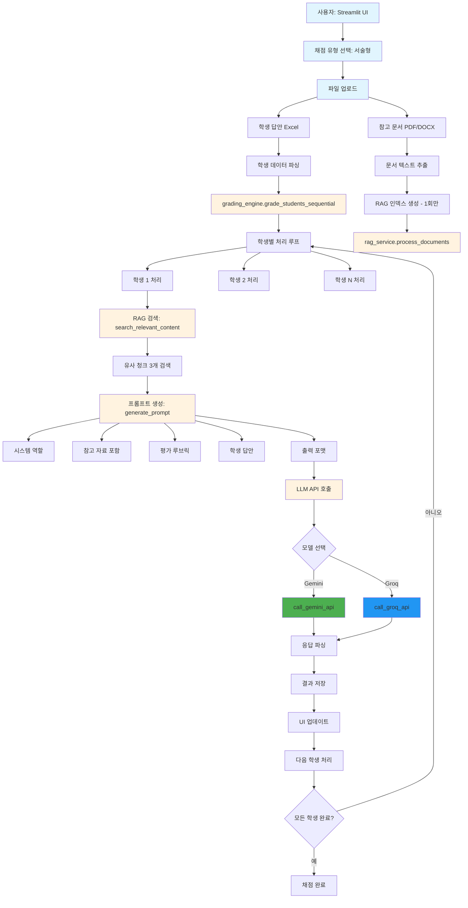
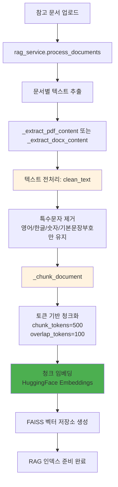
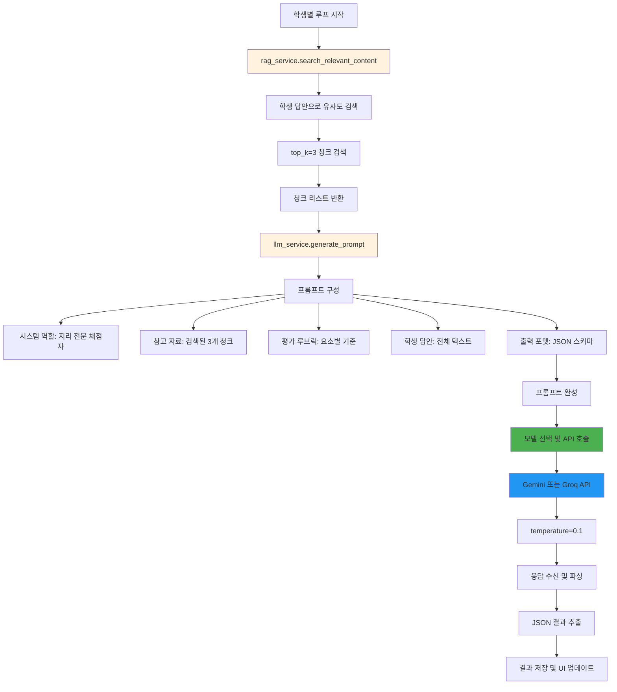
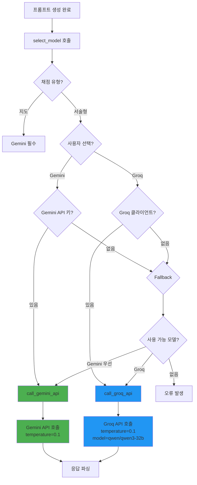

# 서술형 문항 채점 로직 모식도

이 문서는 지리 자동 채점 시스템의 서술형 문항 채점 로직을 Mermaid 다이어그램으로 표현한 것입니다.

## 전체 채점 흐름

## 상세 컴포넌트 설명

### 1. RAG 파이프라인 상세

### 2. 학생별 채점 처리

### 3. API 호출 분기

## 주요 특징

### 🔄 최적화된 RAG 처리
- **1회 인덱싱**: 배치 시작 시 참고 문서로 RAG 인덱스를 한 번만 생성
- **학생별 검색**: 각 학생 답안으로 유사도 검색만 수행 (재인덱싱 없음)
- **토큰 기반 청크**: tiktoken으로 정확한 토큰 수 계산
- **전처리 적용**: 특수문자 제거로 검색 품질 향상

### 🤖 LLM 통합
- **모델 선택**: Gemini (멀티모달) 또는 Groq (텍스트 전용)
- **일관된 설정**: 두 모델 모두 temperature=0.1로 채점 일관성 확보
- **프롬프트 구조**: 시스템 역할 → 참고 자료 → 루브릭 → 답안 → 출력 포맷

### 📊 처리 흐름
1. **준비 단계**: UI에서 파일 업로드 및 설정
2. **인덱싱 단계**: RAG 인덱스 생성 (한 번)
3. **채점 단계**: 학생별로 검색 → 프롬프트 → API 호출 → 결과 저장
4. **완료 단계**: 전체 결과 집계 및 내보내기

이 모식도는 실제 코드의 실행 흐름을 정확히 반영하고 있습니다.